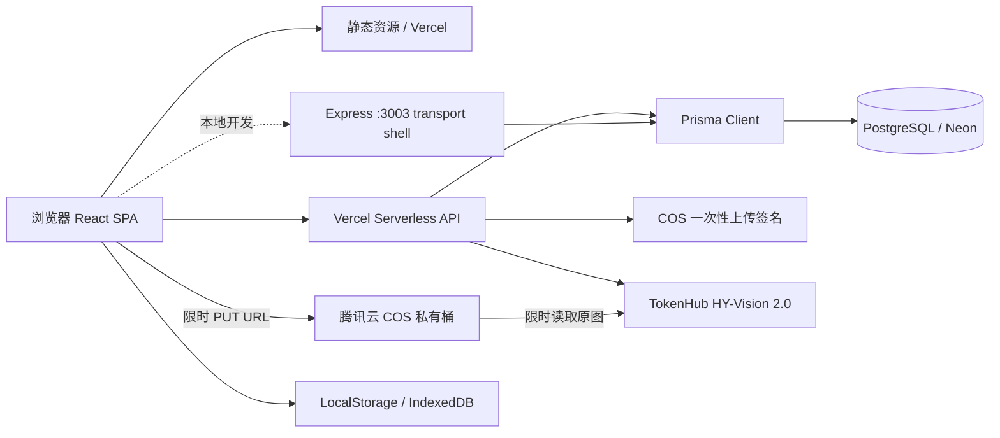

# 谱里 / Puli

一个公益性的多账户数字家谱：让普通家庭可以看家谱、续家谱、管家谱。

> 项目最初为穆氏家谱而建；现在穆氏家谱只是只读示范内容，产品面向所有希望从零建立、补录和长期保存家族记忆的家庭。产品目前处于 MVP 后的种子用户共创阶段。

在线体验：[谱里产品官网](https://tree.tatababa.top)；[穆氏示范家谱](https://tree.tatababa.top/app/demo)

项目欢迎种子用户加入共创，反馈真实家庭的建谱、补谱和协作需求。

## 产品定位

产品定位：**年轻人的第一份家谱。** 让今天的年轻人用手机和数字化工具，从自己开始快速记录父母、祖父母、曾祖辈乃至更远的家族发展脉络，让孩子和后代看得懂家族从哪里来，并能持续补充新的名字、故事、照片和来源。

当前产品核心是：**让家庭中愿意承担整理责任的一个人，先独立、低门槛地建立第一版家谱，再逐步浏览、续录和长期保存。**

首阶段不要求家人协同。发起人可以从自己开始，在几分钟内补充父母和祖辈并看到第一棵家谱；邀请、纠错和共同补充发生在第一版家谱已经产生之后。

长期定位：**以中国传统家谱为入口，让散落在纸册、照片、Excel 和长辈记忆中的家族信息，逐步变成可查看、可续录、可管理、可传给子孙的家庭档案。**

核心目标人群是有数字生活习惯、愿意从自己开始整理家庭记忆的年轻人，尤其是希望让孩子认识祖辈、把纸质家谱、老照片和长辈讲述保存下来的家庭发起人。项目通过真实家谱和种子用户共创冷启动；公益性代表基础能力长期可用，不代表家谱默认公开。

产品默认值：家谱私密、邀请加入、在世人物敏感信息受保护、公开分享由家谱管理员主动开启、数据可导出。

## 已有能力

- 面向桌面浏览与移动传播的产品官网，完整说明产品主张、双线建谱路径、隐私原则、开源与种子用户共创入口。
- React 18 + Ant Design 5 单页应用。
- React Flow 11 + Dagre 家谱图，支持缩放、平移、布局方向和节点详情。
- 穆氏示范家谱支持从明代至当代的代际展开动画，可暂停、拖动时间轴和回到全景。
- 姓名/职位/地点搜索、代数筛选、智能折叠和移动端适配。
- 游客只读浏览“穆氏示范家谱”。
- 邮箱验证码注册、密码找回、密码重置、登录、JWT 会话和个人资料读取。
- 新用户可从示范家谱进入注册；空家谱使用两步向导，先录入本人，再补充父亲或一位长辈，保存后直接查看第一份家谱。
- 已连接本人和父亲后，移动端按 `2/4 → 3/4 → 4/4` 逐代引导补充祖父、曾祖父；不知道姓名时可建立“姓名待考”关系节点，生存状态默认待确认，每次保存后立即回到家谱查看树的生长。
- 用户与家谱空间的真实归属关系，Owner/Editor/Contributor/Viewer 角色基础。
- 创建完成后可继续添加人物；已有人物的资料修改支持按人物增量保存，并继续使用版本冲突保护。
- 移动端“续家谱”可按人物创建生平纪事：手写经历可直接发布，原始文字、录音和照片作为家庭档案依据保留；AI 整理只生成待人工确认的草稿。
- 服务端按家谱隐私设置裁剪在世人物的出生日期、居住地、证件、住址和照片字段；Owner 可在设置页调整成员可见范围。
- Prisma + PostgreSQL/Neon 数据持久化。
- Vercel Serverless API 与本地 Express 开发服务。
- 服务端签名的腾讯云 COS 媒体上传（长期密钥不进入浏览器）、TokenHub HY-Vision 2.0 家谱图片解析、腾讯 ASR 与故事整理。
- 家谱保存事务、数据快照与乐观版本冲突保护。
- LocalStorage/IndexedDB 缓存与搜索历史。

## 架构图



生产环境由 Vercel 提供 React 构建产物和 `api/**/*.js` Serverless Functions；本地 `npm run dev` 同时启动 React 开发服务器和 Express，Express 只负责 CORS、请求体解析和把 `/api/*` 转发到同一套 `api/*.js` handler。结构化家谱数据进入 PostgreSQL，媒体进入 COS 私有桶，浏览器保留缓存与搜索历史。

本地和 Vercel 的业务入口已经收敛：认证、租户授权、家谱数据、媒体和图片解析均执行同一套 handler。Express 不再保留旧版认证、家谱或图片解析业务实现。

## 技术栈

| 层次       | 技术                                 |
| ---------- | ------------------------------------ |
| 前端       | React 18、React Router、Ant Design 5 |
| 家谱可视化 | React Flow 11、Dagre                 |
| 生产 API   | Vercel Serverless Functions          |
| 本地 API   | Express 5                            |
| 数据访问   | Prisma 5                             |
| 数据库     | PostgreSQL，推荐 Neon                |
| 媒体       | 腾讯云 COS                           |
| 图片解析   | 腾讯 TokenHub HY-Vision 2.0          |
| 部署       | Vercel                               |

## 快速开始

环境要求：Node.js 18+、npm、PostgreSQL 数据库。

```bash
git clone https://github.com/yipengmu/family_tree.git
cd family_tree
npm install --legacy-peer-deps
cp .env.example .env
# 填写 DATABASE_URL、DATABASE_URL_UNPOOLED、JWT_SECRET 等配置
npx prisma generate
npm run db:migrate:deploy
npm run dev
```

- 产品官网：http://localhost:3000（手机直接访问时默认进入 `/app`；应用内可通过 `/?from=app` 返回官网）
- H5 产品：http://localhost:3000/app
- 穆氏示范家谱：http://localhost:3000/app/demo
- 本地 API：http://localhost:3003（与 Vercel 共用 `api/*.js` handler）
- 健康检查：http://localhost:3003/health

生产构建会先执行 `prisma migrate deploy`，其中包含存量账号的个人家谱空间和 Owner membership 补齐迁移：

```bash
npm run vercel-build
```

需要把内置穆氏示范谱初始化到指定维护者的空白 Owner 家谱时，先执行只读检查；确认目标账号和数据量后再追加 `--apply`。该命令不会覆盖已有家谱，公开示范入口仍使用独立只读快照。

```bash
npm run demo:bind-maintainer -- --email <维护者邮箱>
npm run demo:bind-maintainer -- --email <维护者邮箱> --apply
```

### Vercel 注册邮件配置

在腾讯云 SES 控制台完成发信域名验证、发信地址和邮件模板审核后，在 Vercel 项目的 Production/Preview 环境变量中配置：

```bash
TENCENTCLOUD_SECRET_ID=腾讯云SecretId
TENCENTCLOUD_SECRET_KEY=腾讯云SecretKey
TENCENT_SES_REGION=ap-guangzhou
TENCENT_SES_FROM_EMAIL=noreply@mail.your-domain.com
TENCENT_SES_TEMPLATE_ID=腾讯云审核通过的模板ID
TENCENT_SES_SUBJECT=家谱创作工具验证码
```

邮件模板中配置 `{{code}}` 和 `{{purpose}}` 两个变量。腾讯云 SES 的验证码邮件使用 `SendEmail` API 和触发类邮件类型，服务端通过 Node.js SDK 调用，密钥不会进入前端。配置完成后重新部署，再调用 `/api/auth/send-code` 验证邮件链路。详细配置见 [腾讯云 SES 发送邮件文档](https://cloud.tencent.com/document/api/1288/51034) 和 [发信域名验证文档](https://cloud.tencent.com/document/product/1288/60652)。

### 纸质家谱照片上传与大模型解析配置

手机和 PC 端选择照片后会立即上传到当前家谱的 COS 私有目录，再由腾讯 TokenHub `HY-Vision-2.0-Instruct` 逐张直接理解文字、版面和世系关系。生产与预览环境必须同时配置以下服务端变量；缺少 `TENCENT_COS_BUCKET` 会导致照片无法保留和解析。

```bash
TENCENTCLOUD_SECRET_ID=腾讯云SecretId
TENCENTCLOUD_SECRET_KEY=腾讯云SecretKey
TENCENT_COS_REGION=ap-guangzhou
TENCENT_COS_BUCKET=完整桶名-appid
TENCENT_TOKENHUB_API_KEY=TokenHub API Key
TENCENT_TOKENHUB_BASE_URL=https://tokenhub.tencentmaas.com/v1
TENCENT_VISION_MODEL=hy-vision-2.0-instruct
```

COS 桶保持私有读写，并为产品域名放行带 `Content-Type` 的 `PUT`；TokenHub 密钥只放服务端。模型结果仅加入待确认表格，不会自动写入正式家谱。接入参数见[腾讯云 TokenHub 多模态理解文档](https://cloud.tencent.com/document/product/1823/130988)。

## 目录结构

```text
family_tree/
├── src/                  # React 前端、页面、家谱图和服务层
├── api/                  # Vercel Serverless API
├── server/               # 本地 Express 传输壳与 API 入口适配器
├── prisma/               # Prisma schema
├── lib/                  # Prisma 客户端等共享运行时代码
├── public/               # 静态资源
├── scripts/              # 数据库、部署和调试脚本
├── tests/                # 集成、端到端和调试测试
├── docs/                 # 已废弃，仅保留迁移说明
├── SPEC.md               # 当前产品与技术规格
├── AGENTS.md             # Agent 执行约束与文档维护规则
└── vercel.json           # Vercel 构建和路由配置
```

## 主要 API

| 方法             | 路径                              | 说明                         |
| ---------------- | --------------------------------- | ---------------------------- |
| POST             | `/api/auth/register`              | 注册并返回 JWT               |
| POST             | `/api/auth/login`                 | 登录并返回 JWT               |
| POST             | `/api/auth/send-code`             | 发送邮箱验证码               |
| POST             | `/api/auth/verify-code`           | 校验验证码                   |
| POST             | `/api/auth/reset-password`        | 使用邮箱验证码重置密码       |
| GET              | `/api/user/profile`               | 获取当前用户资料             |
| GET              | `/api/family-data`                | 读取默认或租户家谱数据       |
| POST             | `/api/family-data`                | 保存租户家谱数据             |
| POST             | `/api/family-data/save`           | 保存家谱数据的兼容入口       |
| GET/POST         | `/api/tenants`                    | 获取或创建租户               |
| GET/PATCH/DELETE | `/api/tenants/:tenantId`          | 获取、更新隐私设置或删除租户 |
| POST             | `/api/people`                     | 在家谱中增量新增人物         |
| GET/PATCH        | `/api/people/:personId`           | 读取或增量修改人物           |
| POST             | `/api/tencent/image-parse`        | 大模型解析纸质家谱照片候选   |
| GET              | `/api/people/:personId/events`    | 读取人物生平纪事             |
| POST             | `/api/people/:personId/memories`  | 保存人物档案原始材料         |
| GET/PATCH        | `/api/memories/:memoryId`         | 读取或修订档案草稿           |
| POST             | `/api/memories/:memoryId/publish` | 人工确认后发布纪事           |
| POST             | `/api/memories/:memoryId/process` | AI/ASR 整理档案草稿          |
| GET              | `/api/health`                     | API 健康检查                 |

## 当前产品边界与下一阶段

### 1. 单人连续建谱已打通，协作闭环仍不完整

有家谱图、搜索、增量新增、人物资料编辑和首版人物生平创建入口，已经支持一个发起人独立建立并持续补充家谱。当前生平链路聚焦按人物记录一段经历、原始材料留存和人工确认发布；跨人物家庭档案、草稿箱、批量整理和成果页仍不完整。邀请、成员管理、待确认、评论、贡献记录和通知也尚未形成完整闭环。

### 2. 归属校验与存量账号迁移已补齐，邀请协作尚未完成

数据库已增加 `TenantMembership`；部署迁移会为没有 ACTIVE membership 的历史账号创建 `user_<id>` 私有家谱空间和 OWNER 归属，登录时仍保留幂等兼容创建。核心家谱、租户和上传接口会校验用户归属与角色；下一步仍需实现邀请、成员管理、待确认和审计界面。

### 3. 数据模型无法承载复杂真实家庭

`FamilyData` 主要依赖 `g_father_id`、`g_mother_id`、`spouse` 和字符串字段。再婚、收养、监护、争议关系、多个来源和有效时间都难以表达。应逐步引入独立的 `Relationship`、`Fact`、`Event`、`Source` 和 `ReviewTask`。

### 4. 整谱保存已有保护，仍需迁移为增量编辑

整谱替换已放入数据库事务，并增加 `DataVersion` 快照和乐观版本检查，可阻止静默覆盖；多人高频协作前仍应迁移为 Person/Relationship 的增量写入。

### 5. 密钥已收口，人物级隐私仍需产品化

生产环境缺少 `JWT_SECRET` 会直接拒绝认证；COS、腾讯 ASR 与 TokenHub 长期密钥只存在服务端变量。下一阶段需把“在世人物、未成年人、住址、联系方式”的字段级可见性真正落实到 API 输出。

### 6. 大模型图片解析已接入，人工确认仍需完善

纸质家谱照片已改为 TokenHub HY-Vision 2.0 直接解析，不再前置调用传统 OCR；原图对象键、模型抄录原文、结构化建议、操作者和任务状态会保留。解析结果不能直接视为家族事实，仍需继续完善逐条接受、修改或拒绝的审核体验。

### 7. 家谱图不是所有场景的最佳主界面

成员数量增加后，连线、缩放和移动端操作会变复杂。列表、搜索、聚焦某一支系、关系路径和时间线应与图形视图并列，而不是让用户只能在大图上找人。

### 8. 缺少可持续回访的成果物

用户创建家谱后，若没有家庭成员补充和可分享成果，很容易一次使用后流失。可以围绕“邀请长辈补充 → 确认资料 → 生成家族年鉴/纪念页”形成闭环。

## 建议优先级

1. 观察 membership 迁移和存量账号登录/建谱链路，补齐迁移后的运营检查。
2. 本地 Express 已收敛为与 Vercel 共用 API handler 的传输壳，后续只新增 `api/` 与 `lib/api-handlers/` 业务实现。
3. 增加可脱敏分享的成果页，再完成邀请、成员管理和补充确认。
4. 在兼容传统父系谱展示的前提下，引入关系、来源和审核模型，再完善图片解析审核、时间线、口述史与家族年鉴成果物。

产品与技术边界见 [SPEC.md](./SPEC.md)，Agent 执行约束见 [AGENTS.md](./AGENTS.md)。`docs/` 已停止作为正式文档入口。
