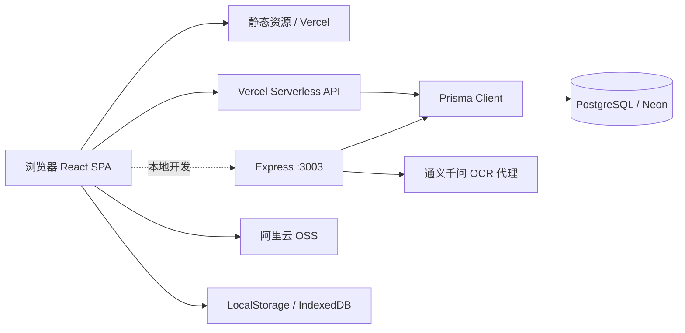

# 🌳 穆氏家谱 / Cyber Family Tree

一个基于 React Flow 的在线家谱可视化与家族资料整理系统。

> 当前版本已经具备可运行的 React 前端、Vercel Serverless API、本地 Express 服务、Prisma/PostgreSQL、用户认证、多租户雏形、OSS 图片上传和通义千问 OCR。本文同时区分“已实现”和“规划中”，避免把愿景误写成现状。

在线演示：[tatababa.top](https://tatababa.top)

## 产品定位

当前产品核心是：**让用户浏览、搜索、维护和可视化家谱数据。**

更适合的长期定位是：**以家谱关系为入口、以家庭记忆和资料传承为差异化的隐私优先协作档案。**

“赛博”可以作为品牌表达，但用户真正需要的是：创建简单、家人愿意参与、资料不丢失、隐私可控、数据可带走。

## 已有能力

- React 18 + Ant Design 5 单页应用。
- React Flow 11 + Dagre 家谱图，支持缩放、平移、布局方向和节点详情。
- 姓名/职位/地点搜索、代数筛选、智能折叠和移动端适配。
- 游客浏览默认穆家家谱。
- 邮箱验证码注册、登录、JWT 会话和个人资料读取。
- 多租户/家族空间选择、创建、切换和删除流程雏形。
- Prisma + PostgreSQL/Neon 数据持久化。
- Vercel Serverless API 与本地 Express 开发服务。
- 阿里云 OSS 图片上传和通义千问家谱图片 OCR。
- LocalStorage/IndexedDB 缓存与搜索历史。

## 架构图



生产环境由 Vercel 提供 React 构建产物和 `api/**/*.js` Serverless Functions；本地 `npm run dev` 同时启动 React 开发服务器和 Express。结构化家谱数据进入 PostgreSQL，图片进入 OSS，浏览器保留缓存与搜索历史。

当前系统存在两条运行时路径，后续应统一 API 契约和数据访问层，避免本地 Express 与 Vercel API 的行为逐渐分叉。

## 技术栈

| 层次 | 技术 |
| --- | --- |
| 前端 | React 18、React Router、Ant Design 5 |
| 家谱可视化 | React Flow 11、Dagre |
| 生产 API | Vercel Serverless Functions |
| 本地 API | Express 5 |
| 数据访问 | Prisma 5 |
| 数据库 | PostgreSQL，推荐 Neon |
| 媒体 | 阿里云 OSS |
| OCR | 阿里云通义千问 |
| 部署 | Vercel |

## 快速开始

环境要求：Node.js 18+、npm、PostgreSQL 数据库。

```bash
git clone https://github.com/yipengmu/family_tree.git
cd family_tree
npm install --legacy-peer-deps
cp .env.example .env
# 填写 DATABASE_URL、DATABASE_URL_UNPOOLED、JWT_SECRET 等配置
npx prisma generate
npx prisma db push
npm run dev
```

- 前端：http://localhost:3000
- 本地 API：http://localhost:3003
- 健康检查：http://localhost:3003/health

生产构建：

```bash
npm run vercel-build
```

### Vercel 注册邮件配置

在腾讯云 SES 控制台完成发信域名验证、发信地址和邮件模板审核后，在 Vercel 项目的 Production/Preview 环境变量中配置：

```bash
TENCENTCLOUD_SECRET_ID=腾讯云SecretId
TENCENTCLOUD_SECRET_KEY=腾讯云SecretKey
TENCENT_SES_REGION=ap-guangzhou
TENCENT_SES_FROM_EMAIL=noreply@mail.your-domain.com
TENCENT_SES_TEMPLATE_ID=腾讯云审核通过的模板ID
TENCENT_SES_SUBJECT=家谱创作工具验证码
```

邮件模板中配置 `{{code}}` 和 `{{purpose}}` 两个变量。腾讯云 SES 的验证码邮件使用 `SendEmail` API 和触发类邮件类型，服务端通过 Node.js SDK 调用，密钥不会进入前端。配置完成后重新部署，再调用 `/api/auth/send-code` 验证邮件链路。详细配置见 [腾讯云 SES 发送邮件文档](https://cloud.tencent.com/document/api/1288/51034) 和 [发信域名验证文档](https://cloud.tencent.com/document/product/1288/60652)。

## 目录结构

```text
family_tree/
├── src/                  # React 前端、页面、家谱图和服务层
├── api/                  # Vercel Serverless API
├── server/               # 本地 Express 服务与 OCR 代理
├── prisma/               # Prisma schema
├── lib/                  # Prisma 客户端等共享运行时代码
├── public/               # 静态资源
├── scripts/              # 数据库、部署和调试脚本
├── tests/                # 集成、端到端和调试测试
├── docs/                 # 历史修复记录和专题文档
├── SPEC.md               # 当前产品与技术规格
└── vercel.json           # Vercel 构建和路由配置
```

## 主要 API

| 方法 | 路径 | 说明 |
| --- | --- | --- |
| POST | `/api/auth/register` | 注册并返回 JWT |
| POST | `/api/auth/login` | 登录并返回 JWT |
| POST | `/api/auth/send-code` | 发送邮箱验证码 |
| POST | `/api/auth/verify-code` | 校验验证码 |
| GET | `/api/user/profile` | 获取当前用户资料 |
| GET | `/api/family-data` | 读取默认或租户家谱数据 |
| POST | `/api/family-data` | 保存租户家谱数据 |
| POST | `/api/family-data/save` | 保存家谱数据的兼容入口 |
| GET/POST | `/api/tenants` | 获取或创建租户 |
| GET/DELETE | `/api/tenants/:tenantId` | 获取或删除租户 |
| GET | `/api/health` | API 健康检查 |

## 当前产品短板与定位问题

### 1. 产品仍偏“可视化工具”，协作闭环不完整

有家谱图、搜索和编辑入口，但缺少邀请、角色、待确认、评论、贡献记录和通知。现在更像一个人维护的数字家谱，距离“让更多家庭创建自己的家谱”还差参与机制。

### 2. 多租户是功能雏形，不是完整权限系统

数据库有 `Tenant`，但没有用户与租户之间的 membership 表；部分接口只验证 JWT，不校验用户是否属于目标租户。创建租户的部分逻辑也只是返回对象或依赖本地缓存。需要优先补上 Owner/Editor/Contributor/Viewer 和每个租户的授权校验。

### 3. 数据模型无法承载复杂真实家庭

`FamilyData` 主要依赖 `g_father_id`、`g_mother_id`、`spouse` 和字符串字段。再婚、收养、监护、争议关系、多个来源和有效时间都难以表达。应逐步引入独立的 `Relationship`、`Fact`、`Event`、`Source` 和 `ReviewTask`。

### 4. 数据保存方式有丢失和协作冲突风险

保存接口会先删除某租户全部数据，再批量插入新数组；多人同时编辑时可能互相覆盖，也不利于审计和恢复。应改为事务化增量写入，并使用版本号或乐观锁。

### 5. 隐私与密钥安全需要立即处理

在世人物、身份证件、住址和联系方式不应默认公开。更严重的是，`REACT_APP_OSS_ACCESS_KEY_SECRET` 这类前端环境变量会进入浏览器构建产物，长期密钥不应放在客户端；应改为后端签名 URL 或 STS 临时凭证。生产环境也不应使用代码中的 fallback JWT secret。

### 6. OCR 有效率价值，但缺少“人工确认”边界

OCR 很适合降低录入成本，但识别结果不能直接视为家族事实。需要保存原图、原始文本、结构化建议、操作者和确认状态，并允许逐条接受、修改或拒绝。

### 7. 家谱图不是所有场景的最佳主界面

成员数量增加后，连线、缩放和移动端操作会变复杂。列表、搜索、聚焦某一支系、关系路径和时间线应与图形视图并列，而不是让用户只能在大图上找人。

### 8. 缺少可持续回访的成果物

用户创建家谱后，若没有家庭成员补充和可分享成果，很容易一次使用后流失。可以围绕“邀请长辈补充 → 确认资料 → 生成家族年鉴/纪念页”形成闭环。

## 建议优先级

1. 修复租户归属校验、JWT fallback secret 和 OSS 客户端长期密钥问题。
2. 统一 Vercel API 与 Express 本地 API 的契约和数据访问层。
3. 实现真实的租户 membership、角色权限和邀请流程。
4. 在保留旧字段兼容性的前提下，引入关系、来源、版本和审核模型。
5. 再做家庭协作、时间线、口述史和年鉴成果物。

完整产品与技术规格见 [SPEC.md](./SPEC.md)。历史修复记录见 [docs/README.md](./docs/README.md)。
