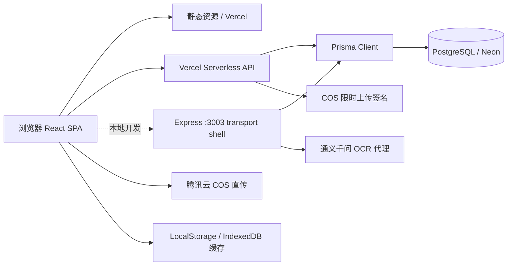

# 谱里数字家谱产品、技术与 Agent 维护规格

版本：v1.1
状态：MVP 后的公益多账户共创与官网设计基线
更新时间：2026-07-15

## 1. 当前产品定义

本项目是一个面向普通家庭的公益性、隐私优先、多账户数字家谱软件。它服务两类人：想从零建家谱的家庭，以及家里只有长辈手中的纸质册子、照片或零散记忆，想逐步复刻和续录的家庭。产品首先服务家庭中愿意长期承担整理责任的单个发起人，不把多人协同作为开始建谱的条件。

产品定位：**年轻人的第一份家谱。** 面向有数字生活习惯、愿意主动整理家庭记忆的年轻人，让他们通过手机和数字化工具，从自己开始快速建立父母、祖父母、曾祖辈乃至更远的家族发展脉络；让孩子和后代能够看懂家族历史，并持续补充新的名字、故事、照片和来源。

核心主张：**看家谱，续家谱，管家谱。**

产品愿景：把纸册、照片、Excel、长辈记忆和数字化工具逐步连接起来，让年轻人可以更快开始记录家事，把家族的世系、人物、地域迁徙、照片、故事和来源留给孩子与子孙。产品可以使用互联网与 AI 降低整理门槛，但不能让技术取代家人的确认和记忆。

默认隐私：家谱私密、仅受邀成员访问、在世人物敏感信息受保护、公开分享由 Owner 主动开启。

当前主导航固定为：`看家谱`、`续家谱`、`家谱设置`。穆氏仅是只读示范家谱，不代表平台姓氏，也不应与用户家谱混淆。

当前产品仍然更接近“家谱可视化 + 数据编辑工具”，尚未完整实现“多人共同维护的家庭数字档案”。

当前增长路径是：**一个发起人独立完成第一版家谱 → 看到可用成果 → 分享给家人查看、纠错和补充 → 再逐步形成协作档案。** 新用户激活优先于成员邀请，协同能力不能阻塞单人建谱。

产品同时服务两条互相衔接的建谱路径，但共用同一套家庭档案，不拆成两个彼此割裂的产品：

1. **承接已有族谱**：面向已有纸谱、世系资料或长期整理成果的家庭，支持超长代际的世系展示、检索和持续数字化。穆氏示范家谱用于证明这条路径的展示上限，但不应让新用户误以为开始建谱前必须先拥有完整族谱。
2. **从零建立家谱**：面向没有现成族谱的年轻家庭，从本人开始，先连接一位父母或长辈，再逐步覆盖以本人为中心的约四代家庭脉络，例如向上记录父母、祖父母，向下记录儿女。四代是帮助用户理解近期目标的常见范围，不是数据上限，也不能成为保存门槛。

两条路径的共同目标不是生成一张一次性关系图，而是形成可以多年补充的家庭档案：既能承载长代际世系，也能记录当代家庭成员的照片、重要经历、手艺、工作、家庭角色和家人讲述。

## 2. PC 官网产品与实现规格（v1 基线）

### 2.1 官网使命与成功定义

PC 官网是全面说明产品主张、建立信任并引导开始使用的品牌阵地，不是把现有 H5 功能放大到桌面，也不是功能列表或传统家谱文化展板。官网首先服务“想给自己家庭建谱的年轻人”，帮助访客依次回答：

1. 这件事为什么与我有关；
2. 为什么现在开始仍然来得及；
3. 谱里如何让开始变得足够简单；
4. 为什么可以把家庭资料交给谱里；
5. 下一步应当浏览示范谱、开始建谱还是加入共创。

官网的核心用户任务是：**别让家人的名字和故事消失。** 情绪基调采用“温暖克制”，承认老人离去、记忆分散和家庭迁徙造成的信息流失，但不利用死亡焦虑制造紧迫感；每次提醒失去之后，都应给出“现在开始还来得及”的具体行动。

官网转化不是四个并列按钮，而是一条由浅入深的漏斗：

`浏览真实示范家谱 → 注册 → 录入本人 → 连接至少一位真实家人 → 关注公众号并加入共创`

- 北极星激活指标：新建家谱中形成第一条真实家庭关系，即本人和至少一位父母、长辈或其他家人已经连接。
- 过程指标：示范谱浏览、注册完成、第一位人物保存。
- 共创指标：关注“塔塔爸爸”，通过关键词进入种子用户共创流程。
- 进群人数和注册量不能单独作为产品成功依据；没有产生家庭关系的注册不代表用户已经获得家谱价值。

### 2.2 品牌主张与首屏文案

首屏采用以下信息层级，后续实现不得在没有产品讨论的情况下随意替换为功能口号：

- 品牌定位语：`年轻人的第一份家谱`
- 主标题：`别让家人的名字和故事，散落在记忆里`
- 副标题：`从自己开始，逐步记录父母、祖辈和更远的家族脉络。知道多少记多少，让孩子知道我们从哪里来。`
- 主行动：`免费创建我的家谱`
- 次行动：`看看一份真实家谱`
- 首屏信任提示：`默认私密 · 数据可带走 · 核心代码开源`

“年轻人的第一份家谱”承担定位作用；“别让家人的名字和故事消失”承担用户价值；“从自己开始”承担行动引导。三者不能堆叠成同一句长口号。

首屏视觉应表现名字逐渐连接成家庭关系，并从其中一位人物展开照片或一条生活记录。不能用一棵没有人物内容的抽象大树代替产品，也不能在首页首屏加载完整的超长代际家谱。

### 2.3 页面内容结构

官网按以下顺序组织。桌面端可完整展开；移动端允许缩短段落和减少装饰，但必须保持相同的叙事顺序与行动层级。

#### A. 顶部导航

- 左侧：谱里品牌标识与“年轻人的第一份家谱”。
- 中部锚点：`为什么记录`、`如何开始`、`产品能力`、`真实故事`、`隐私与开源`、`共创计划`。
- 右侧：低权重 `登录`，高权重 `免费创建`。
- 导航随页面滚动保持可访问；不能用过多产品内部菜单干扰官网阅读。

#### B. 首屏主张

- 使用 2.2 中确定的主标题、副标题和双行动。
- “免费创建”在桌面端和移动端都直接进入当前设备上的注册与创建链路，不使用跨设备扫码弹窗阻断流程。
- “看看一份真实家谱”进入穆氏示范家谱，不要求先注册。

#### C. 家族记忆如何慢慢消失

通过三个具体而非宏大的生活场景说明问题：

1. 老照片还在，却没人知道照片里是谁；
2. 知道祖辈的名字，却不知道他经历过什么；
3. 故事散落在不同长辈的记忆里，一直没有被整理。

建议收束文案：`家族记忆很少在某一天突然消失。它只是随着一次次“以后再问”，慢慢无人知晓。`

本段不得使用没有可靠来源的比例、代际认知统计或恐惧式倒计时。

#### D. 两种家庭，同一个开始方向

以并列但不等权的方式说明两条产品路径：

- 从零开始：即使没有纸质家谱，也可以先记录自己，再连接一位家人，逐步维护祖父母、父母、本人和儿女等约四代近期家庭。
- 承接已有族谱：已有纸谱、Excel、照片或超长世系资料的家庭，可以逐步数字化、检索和补充；穆氏示范家谱用于展示长代际承载能力。

官网核心用户仍然是从零开始的年轻人，因此该路径在版式、文案和按钮上应更突出。超长族谱是产品上限证明，不能成为新用户的开始门槛。

#### E. 两步开始第一份家谱

展示真实的最低启动过程：

1. `先把自己写进家谱`；
2. `再连接一位父母、长辈或家人`。

核心说明：`第一版不需要完整。先建立第一条家庭关系，以后再慢慢补充。`

官网可以承诺“几分钟开始一份家谱”，不能在尚未验证时承诺“几分钟完成一份家谱”。

#### F. 看家谱、续家谱、管家谱

本段只展示已经上线或已有稳定代码支撑的能力：

- 看家谱：浏览家庭关系、搜索人物、理解代际脉络；
- 续家谱：添加人物、补充关系和人物资料；
- 管家谱：使用私密家庭空间保存和维护资料，并按现有能力说明权限与隐私。

邀请协作、完整人物生平、公开成果页、审核工作流和年鉴等未完成功能不得混入现有能力卡片。

#### G. 真实家庭故事与第一位深度用户

使用项目发起人的真实整理过程建立可信度，核心身份不是“家谱专家”，而是“正在整理自己家庭记忆的普通年轻人，也是谱里的第一位长期用户”。建议叙事素材包括：

- 从父亲讲述中知道曾祖父读《毛选》、做过兽医、会木工，也会制作家用木箍桶；
- 知道祖母年轻时曾在老家教过小学；
- 说明这些普通生活若没有被询问和记录，下一代可能只剩下一个姓名。

真实人物、照片和故事上线前必须确认公开范围。在世人物和未成年人默认不作为公开营销素材；如确需使用，应取得本人或监护人的明确同意，并避免暴露住址、联系方式、证件和精确出生日期。

#### H. 正在共创：让名字长出生平

人物生平仍是正在共创的产品里程碑。移动端首版已经支持从一位家人进入人物志，手写发布一段生平纪事，并把原始文字、录音和照片保留为家庭档案依据；完整时间线编辑、跨人物档案、草稿恢复和成果页仍未完成。官网必须继续标记为 `正在共创`，不能把首版创建链路描述成完整人物生平能力。

人物生平的产品主张是：`以人物为中心，把散落的姓名、照片、经历和家人讲述，整理成一份可以逐年补充的家庭生平档案。`

首阶段方向包括：

- 基本身份与家庭关系；
- 人生阶段和重要经历；
- 工作、手艺、兴趣与家庭角色；
- 照片及其时间、地点和人物说明；
- 家人讲述的普通生活片段；
- 信息来源、待考状态与确认情况；
- 对在世人物和未成年人的隐私保护。

人物生平强调“重要经历与普通生活”，不应简化成“关键成就”或家庭荣誉墙。对孩子的成长记录属于家庭私密档案，不得默认公开。

#### I. 隐私、数据归属与开源

信任区应使用可以由现有产品原则和代码支撑的明确陈述：

- 家谱默认私密，仅授权成员访问；
- 在世人物、未成年人、住址和联系方式默认受保护；
- AI/OCR 只生成草稿，不能自动成为家庭事实；
- 家庭资料应可导出、备份和迁移；
- 核心代码已经开源，可自行部署，避免家庭资料被单一平台锁定。

官网正文不把 GitHub 地址作为主要转化按钮。页脚保留低权重的源码链接，指向 `https://github.com/yipengmu/family_tree`；希望获得部署说明和交流支持的用户，引导关注“塔塔爸爸”并回复 `开源`。不得把“可自行部署”写成当前尚不存在的“一键本地安装”。

#### J. 共创与最终行动

官网后半段说明产品处于种子用户共创阶段，并区分两个公众号关键词：

- 回复 `家谱`：表达家庭建谱需求，进入种子用户共创或后续自动拉群流程；
- 回复 `开源`：获取开源部署指引与相关交流支持。

共创区使用“塔塔爸爸”公众号二维码。二维码旁必须同时提供文字说明，不能让扫码成为唯一可理解的入口。最终主行动仍为 `免费创建我的家谱`，共创群是激活后的长期联系，不取代产品开始路径。

#### K. 页脚

至少包含：产品名称、公益与隐私原则摘要、官网地址、登录/创建入口、隐私与数据说明入口、低权重 GitHub 源码链接、公众号名称。没有完成的法律页面不得以可点击链接伪装存在。

### 2.4 视觉与内容风格

官网采用“现代家庭档案”作为主视觉，不采用浓重祠堂或仿古族谱风格。

- 色彩：米白纸张、墨色、松柏绿，朱砂红只用于印记和关键行动；
- 排版：现代中文排版、大面积留白、清晰层级，避免整页书法字体；
- 素材：真实家庭照片、纸谱局部、人物卡片、档案标签、关系线和手写注释；
- 动效：表现姓名、关系和记忆逐步连接；完整穆氏长代际动画只在示范谱或专门展示段落中使用；
- 禁止倾向：卷轴、祠堂、龙纹、金色牌匾、宗族权威感、科技蓝数据流和无人物内容的抽象树；
- 语气：具体、平实、温暖克制，不把普通家庭包装成宏大历史，也不暗示只有有名望或完整族谱的家庭才值得记录。

真实素材优先于通用图库。素材不足时使用清楚标注的示意内容，不得虚构成真实穆氏人物或用户见证。

### 2.5 路由与设备策略

官网与 H5 产品使用统一 URL 语义；桌面端保留官网默认入口，手机端优先进入 H5：

| 路径          | 目标                                             |
| ------------- | ------------------------------------------------ |
| `/`           | 桌面端产品官网；手机端默认跳转到 `/app`          |
| `/app`        | H5 产品入口                                      |
| `/app/create` | 创建与续录入口；未登录时保留该返回路径并进入注册 |
| `/app/demo`   | 穆氏示范家谱，只读且无需注册                     |
| `/login`      | 登录                                             |
| `/register`   | 注册并保留返回创建链路                           |

- `/app` 承载 H5 产品，设备入口调整不能破坏登录、注册、重置密码、租户选择和现有 H5 内部导航。
- 官网主按钮在桌面端和移动端都直接进入 `/app` 的创建链路；未登录时先进入 `/register` 并保留创建返回路径。
- 示范谱、邀请、人物分享等传播场景应使用对应深链接，不强迫用户绕回官网。
- 手机直接访问 `/` 时默认重定向到 `/app`；H5 顶部提供官网入口，并使用 `/?from=app` 明确请求官网页面，避免官网与 H5 之间循环跳转。
- 通过 `/?from=app` 打开的移动官网仍保持短路径：首屏可直接开始、底部可提供不遮挡内容的固定行动按钮。
- 官网首屏不得依赖认证、租户或家谱数据 API 才能完成渲染；H5 应用和完整示范谱应按路由懒加载，避免 624 人示范数据影响官网首屏。

### 2.6 交互、响应式与无障碍

- 桌面端首屏同时可见核心主张、主行动、次行动和一项真实产品视觉；正文控制在适合阅读的最大宽度内。
- 移动端缩短解释文本但保留问题、开始方法、信任和行动；主按钮触控高度不小于 44px。
- 关系展开动效必须支持 `prefers-reduced-motion`；减少动态时直接显示最终关系状态。
- 所有照片提供有效替代文本；关系预览不能只靠颜色表达代际或关系。
- 键盘可以访问导航、按钮、二维码替代入口和交互示例；焦点样式清晰。
- 二维码应同时显示用途和关键词；无法扫码的用户仍可通过文字路径继续。
- 官网不得自动播放有声视频，不得用全屏弹窗阻断首次阅读。

### 2.7 搜索、分享与性能

- 页面标题建议：`谱里｜年轻人的第一份家谱`。
- 页面描述围绕“从自己开始、记录父母祖辈、默认私密、可持续补充”，不堆砌“族谱制作软件”等关键词。
- Open Graph 分享图使用品牌、真实人物关系与主标题，不展示在世人物或未成年人隐私。
- 官网必须可被搜索引擎读取核心文案，不能把全部主张放进图片或 Canvas。
- 生产环境移动网络下首屏 LCP 目标不高于 2.5 秒，CLS 目标不高于 0.1；完整家谱、视频和高分辨率照片不得进入首屏关键加载路径。

### 2.8 事件观测

在遵循隐私原则、不过度采集个人信息的前提下，官网和 H5 至少区分以下事件：

- `homepage_view`
- `hero_create_click`
- `demo_view_click`
- `app_create_open`
- `registration_complete`
- `first_person_saved`
- `first_relationship_created`
- `wechat_co_creation_intent`
- `wechat_open_source_intent`

`first_relationship_created` 是核心激活事件。公众号二维码应使用能够区分 `家谱` 与 `开源` 意图的落地参数或后续关键词统计；无法可靠归因时不得用估算值冒充精确转化。

### 2.9 内容真实性边界

官网必须明确区分三类内容：

1. `现在可以`：已经上线且可通过真实路线验证；
2. `正在共创`：已确定为近期里程碑，但尚未完整上线；
3. `长期方向`：人物档案、家庭协作和成果物的演进愿景。

禁止：

- 把完整人物生平、邀请协作、审核、年鉴等规划包装成现有能力；
- 使用虚构用户评价、虚构合作方或没有来源的行业数据；
- 暗示 AI 能判断、修复或自动确认家族事实；
- 暗示家谱默认公开；
- 用“完整还原家族历史”否认未知、待考和多个说法；
- 用公开开源仓库地址作为必须关注公众号才能获得的独占资源。

### 2.10 首版与后续素材清单

官网首版实现和后续真实内容替换需要准备或确认：

- 谱里现有品牌标识的可用矢量或高清版本；
- [已提供] “塔塔爸爸”公众号二维码：`public/assets/tatababa-wechat-qr.jpg`；实现时在二维码旁分别说明回复 `家谱` 和 `开源` 的用途；
- 1 组经确认可公开的穆氏人物故事；
- 与故事对应的照片、旧物或纸谱素材；没有公开授权时使用匿名或示意素材；
- 当前 H5 创建流程和穆氏示范谱的真实截图或录屏；
- 隐私与数据说明的可发布文本；
- GitHub 仓库链接与实际部署前置条件说明。

### 2.11 首版官网验收标准

1. `/` 在桌面端展示官网、在手机端默认跳转 `/app`；手机 H5 可点击左上角“谱 + 谱里”品牌区，携带 `?from=app` 返回官网且不循环跳转；`/app/demo` 可直接浏览只读穆氏示范家谱。
2. 官网无需等待认证、租户或家谱数据请求即可显示完整首屏。
3. 首屏使用本规格确定的价值层级，并同时提供创建和示范谱入口。
4. 桌面端和移动端主行动都可以在一次点击内进入当前设备的注册或创建链路，不出现要求切换设备的扫码弹窗。
5. 官网清楚说明从零四代维护与已有超长族谱承接两条路径，同时保持“从零开始的年轻人”为首要用户。
6. 现有能力、正在共创和长期方向在视觉与文案上可以明确区分。
7. 真实家庭故事经过公开范围确认；在世人物与未成年人敏感信息不进入公开页面。
8. 隐私、数据可带走和开源原则可被用户在首页正文中找到；GitHub 只作为低权重源码入口，部署支持通过公众号承接。
9. 主页面满足键盘访问、减少动态、替代文本和移动触控要求。
10. 验证完整路径：官网 → 示范谱、官网 → 注册/创建 → 第一位人物 → 第一条家庭关系，以及官网 → 公众号共创/开源指引。

## 3. 当前实现范围

### 已实现或已有代码支撑

- `/` 桌面官网、`/app` H5 产品和 `/app/demo` 穆氏只读示范谱已经拆分；手机访问 `/` 默认进入 H5，并可通过携带 `?from=app` 的官网入口返回官网；官网包含双线建谱主张、真实故事、隐私与开源、公众号共创入口，以及桌面与移动端各自在当前设备上直达注册/创建的链路。
- React 18 单页应用，Ant Design 5 界面。
- React Flow 11 + Dagre 家谱图、节点详情、缩放/平移、布局方向。
- 姓名、职位、地点搜索，代数筛选和智能折叠。
- 游客模式只读浏览“穆氏示范家谱”。
- 邮箱验证码注册、密码找回与重置、登录、JWT 会话和个人信息读取。
- `TenantMembership` 绑定用户与家谱，核心接口执行角色校验。
- 家谱保存使用事务、版本快照和乐观冲突检查。
- `/api/people` 支持人物增量新增和修改；整谱保存接口继续保留用于兼容导入和批量编辑。
- `/app/person/:personId` 提供人物志与家庭档案深链；移动端可从“续家谱”选择人物，也可从家谱节点进入。手写经历可以直接发布为纪事，录音、照片和原始文字保留在关联 `Memory` 中；AI/ASR 只生成待人工确认的多条纪事草稿。
- 人物读取按角色和 `Tenant.settings.privacy` 执行字段级裁剪；Owner 可更新隐私规则，AI/OCR 不得绕过该裁剪。
- COS 上传使用服务端限时签名，浏览器不持有长期密钥。
- Prisma + PostgreSQL 数据持久化；Vercel Serverless API。
- 本地 Express 传输壳，只负责本地开发的 CORS、请求体解析和 `/api/*` 路由适配；业务逻辑与 Vercel 共用 `api/*.js` handler，不再维护 Express 认证、家谱或 OCR 副本。
- 腾讯云 COS 媒体存储；腾讯 OCR 保存原始文字；TokenHub 视觉模型生成结构化候选；腾讯 ASR 处理录音。
- 浏览器缓存、LocalStorage 和 IndexedDB 搜索历史。

### 当前不应对外承诺为完整能力

- 邀请、成员管理与 Contributor 待确认工作流尚未实现。
- 默认示范租户与用户私有家谱是两条明确的数据链；示范租户始终只读。
- 穆氏家谱由指定维护账号在其私密 Owner 家谱空间中持续维护，人物生平、家庭档案和后续资料均归属该账号的同一租户。公开 `/app/demo` 仍是与维护空间隔离的只读快照；维护空间中的新增或修改不得自动公开，必须经过单独发布和隐私复核。
- 家谱保存仍是整谱替换，虽已有事务与冲突保护，但尚未升级为人物级增量编辑。
- `FamilyData` 以父母 ID、配偶字符串和子女字段承载关系，没有独立关系、来源、事件和证据实体。
- `DataVersion` 只具备快照模型，尚未形成面向用户的版本恢复、审计或审核工作流。
- 没有完整的邀请、成员角色、评论、待确认和协作通知体系。
- 公开分享、媒体元数据管理、结构化导入导出和家族年鉴成果物仍不完整。
- 人物志首版尚未提供草稿箱、失败任务恢复、跨人物家庭事件、完整修订界面和公开成果页，不应对外承诺为完整人物生平产品。

## 4. 用户与核心场景

### 目标用户

- 核心目标人群：有数字生活习惯、希望快速建立家族脉络的年轻人；他们通常是家中主动拿起手机或电脑开始记录的人，也希望让孩子认识爷爷、曾爷爷及更远的家族发展。
- 家谱发起人：独立建立并持续整理第一版家谱，产生可查看的成果后再邀请家人参与。
- 家谱整理者：维护人物信息、关系、照片和 OCR 结果。
- 普通家庭成员：搜索、浏览、补充和确认信息。
- 家族研究者：查看来源、版本和迁徙/事件脉络。

### MVP 后续验收场景

1. 用户注册后进入自己的独立家族空间，无需邀请其他成员即可开始。
2. 用户从本人开始，在两步向导中按已知情况补充一位父母或长辈；只知道自己时也允许先保存，目标是在首次使用中快速形成一份可查看的第一版家谱，并在之后持续补充祖辈和更久远的家族脉络。
3. 用户可在图形、列表和人物详情之间切换浏览。
4. 用户邀请成员加入，并按角色限制查看/编辑范围；在邀请能力尚未完成前，不对外宣称已支持完整协作。
5. 用户上传照片或家谱图片，OCR 结果必须经过人工确认才能入库。
6. 用户可以查看修改记录、撤销分享并导出完整数据。

## 5. 功能规格

### 5.1 家族空间与权限

建议角色：Owner、Editor、Contributor、Viewer。

- Owner：管理空间、成员、权限、导出和删除。
- Editor：维护人物、关系和记忆，处理确认任务。
- Contributor：新增或补充资料，不能删除关键数据。
- Viewer：只读访问授权内容。

权限必须绑定到 `tenantId + userId`，不能仅凭“登录过”访问任意租户。

### 5.2 人物与关系

保留现有 `FamilyData` 的兼容字段，同时逐步引入规范化实体：

- Person：姓名、别名、性别、出生/逝世、地点、简介、头像。
- Relationship：父母、子女、配偶/伴侣、收养、监护等关系类型。
- Fact：可带来源、置信度、确认状态和有效时间的事实。
- Event：出生、婚姻、迁徙、教育、职业和逝世等事件。

生存状态继续兼容现有 `FamilyData` 约定：历史字段 `dealth`/`death_date` 中的 `alive` 表示在世，编辑界面的 `alive` 布尔值必须在保存和读取时与历史字段同步；不得因字段别名不一致把在世人物误判为已故，也不得覆盖已有逝世日期。

首版展示聚焦传统父系谱；底层迁移时仍应让关系成为一等实体，为母系记录和历史资料完整性留出空间，但不在首版突出复杂现代家庭模式。

### 5.3 记忆、媒体与 OCR

- Memory：照片、音频、视频、文档、文字故事和口述史。
- 每条 Memory 可关联人物、关系、事件、地点和时间段。
- OCR 输出保存原图、原始识别文本、结构化建议、操作者和确认状态。
- AI 结果只能作为草稿，不得自动覆盖已确认事实。
- 首版移动创建链路以“选择人物 → 记录文字/原声/照片 → 直接人工发布或 AI 整理 → 人工确认 → 写入人物志”为准；手写直接发布不依赖 AI 服务可用性。

### 5.4 搜索与展示

- 家谱图：适合关系总览和聚焦某一支系。
- 列表：适合大量成员、批量编辑和移动端。
- 时间线：适合故事和事件。
- 搜索：按姓名、别名、地点、职业和关联关系检索。
- 图形视图必须提供文本/列表替代，保证可访问性。

## 6. 数据模型建议

现有核心模型：`User`、`Tenant`、`TenantMembership`、`FamilyData`、`FamilyConfig`、`DataVersion`、`VerificationCode`。

下一阶段建议补充：

`Invitation`、`Person`、`Relationship`、`Fact`、`Event`、`Memory`、`MediaAsset`、`Source`、`ReviewTask`、`Comment`、`AuditLog`。

迁移原则：先为现有 `FamilyData` 建兼容层，再逐步把关系、事实和媒体从 JSON/字符串字段迁出；不要一次性破坏现有默认家谱和接口。

## 7. 系统架构

### 运行时说明

- 生产路径：React 构建产物由 Vercel 提供，`api/**/*.js` 作为 Serverless Functions，Prisma 访问 Neon PostgreSQL。
- 本地路径：`npm run dev` 同时启动 Create React App 和 Express；Express 只把 `/api/*` 适配到与 Vercel 相同的 `api/*.js` handler，前端通过 proxy 访问 `localhost:3003`。
- 数据流：前端先读取默认数据或缓存，再异步请求租户数据；保存时向 API 提交租户下的整批数组。
- 媒体流：前端向服务端申请五分钟有效的 PUT URL 后直传 COS；读取时再次鉴权并生成短时 GET URL，长期密钥只在服务端。
- OCR 流：图片上传后由共享 OCR handler 调用云端 OCR/视觉服务，再返回结构化候选数据；本地 Express 不再单独实现 OCR。

## 8. 安全、隐私与可靠性要求

- 生产环境禁止使用代码内 fallback JWT secret，缺失时应启动失败。
- 不得把 `TENCENTCLOUD_SECRET_KEY`、COS 或 TokenHub 密钥打进浏览器构建产物。
- 所有租户读写接口都要校验 membership/owner，不得只校验 JWT 有效性。
- 在世人物、未成年人、住址、联系方式和证件信息默认私密。
- API 输出必须按字段裁剪：普通成员默认只能看到在世人物的出生年份，不能看到证件、住址、照片和当前居住地；Owner/Editor 的编辑读取仍需受邀 membership 保护。
- 保存操作采用事务、校验和版本号，避免“先删后插”造成数据丢失。
- OCR、导出、分享和删除都要记录审计日志。
- 提供 JSON/CSV + 媒体索引导出，避免用户被平台锁定。

## 9. 分阶段路线

### P0：收敛现有系统（本轮已完成主体）

已完成：通用品牌与主框架、租户归属校验、生产 JWT 强制配置、服务端 COS 签名、整谱事务与版本冲突保护、membership 存量账号归属迁移、本地 Express 与 Vercel API handler 统一入口、基础云服务用量记录、字段级隐私输出。待完成：接口回归测试。

### P1：可用的个人家谱（本轮已完成主体）

已完成单个发起人从注册、建立第一版家谱到持续补录的链路、人物增量新增/修改、字段级隐私规则和冲突保护。待补：人物删除、独立关系编辑、导入导出校验和版本恢复界面。

### P2：家庭协作档案（已启动）

已完成按人物保存 `Memory` 原始材料、人工发布 `Event`、移动端人物志创建入口和基础时间线展示。后续继续提供脱敏分享、成员邀请、角色权限、草稿恢复、待确认、评论、跨人物来源、完整时间线编辑和照片/口述史管理。

### P3：智能整理与成果物

OCR 人工审核、重复人物提示、故事整理、家族年鉴/PDF/分享页生成。

## 10. 公益产品原则

1. **普通家庭优先**：不要求用户懂谱牒、数据库或复杂家族术语；从一个人、一张照片、一段口述也能开始。
2. **记录优先于完美**：允许未知、待考、多个说法和来源并存，不为了“好看”擅自补全或抹平争议。
3. **隐私优先于传播**：默认私密、按家谱空间隔离；在世人物、未成年人、住址、联系方式和证件信息默认不公开。
4. **人工确认事实**：OCR 或 AI 只能生成草稿，必须保留原始材料，并由人确认后才能成为正式事实。
5. **可带走、可延续**：提供可理解、可备份、可迁移的导出；避免用户因平台变化失去家族资料。
6. **面向子孙的可读性**：产品输出不仅服务录入者，也要让多年后的家人能看懂人物、关系、时间、地点和来源。
7. **公益与可持续并存**：基础建谱和浏览能力应长期可用；商业化、云资源和运营成本不能以牺牲隐私或数据可携带性为代价。

## 11. Agent 工作协议

### 文档优先级

Agent 每次开始任务时按以下顺序理解项目：

1. `README.md`：项目是什么、如何运行、如何参与。
2. `SPEC.md`：当前定位、不可违反的产品/技术/隐私边界，以及明确的未来方向。
3. `AGENTS.md`：代码修改、测试、安全和文档维护的执行约束。
4. 代码、数据库 schema、迁移和测试：以当前实现验证规格，不把旧文档当作事实来源。

`docs/` 已废弃。不要在其中新增设计说明、修复总结或路线图；若发现旧文档与代码冲突，以代码、测试和本文件为准，并在必要时更新本文件。

### 修改前检查

- 明确改动属于“看家谱、续家谱、管家谱”中的哪一类。
- 涉及用户、家谱、媒体或 AI 时，先检查租户隔离、角色授权、隐私裁剪和数据可恢复性。
- 涉及数据结构时保留 `FamilyData` 兼容读取，优先增量迁移，不静默覆盖已确认事实。
- 涉及 OCR/AI 时确认原图、原文、候选结果和人工确认状态仍可追溯。
- 不把演示家谱、测试数据或旧修复方案误当成用户数据和现行架构。

### 修改后交付

- 对行为变化添加或更新聚焦测试，至少覆盖授权、租户隔离、版本冲突和隐私过滤中的相关项。
- 运行与改动范围匹配的 lint、format、测试和 build；报告未运行的检查及原因。
- 若改变产品规则、数据模型、权限、隐私或部署路径，同步更新本文件。
- 保持 README 的命令、链接和产品描述可用；避免新增临时性长文档。
