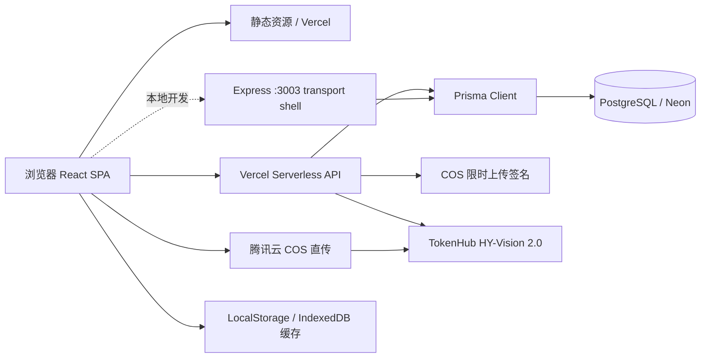

# 谱里数字家谱产品、技术与 Agent 维护规格

版本：v1.4
状态：MVP 后的公益多账号共创与官网设计基线
更新时间：2026-07-17

## 1. 当前产品定义

本项目是一个面向普通家庭的公益性、隐私优先、多账号数字家谱软件。它服务两类人：想从零建家谱的家庭，以及家里只有长辈手中的纸质册子、照片或零散记忆，想逐步复刻和续录的家庭。产品首先服务家庭中愿意长期承担整理责任的单个发起人，不把多人协同作为开始建谱的条件。

产品定位：**年轻人的第一份家谱。** 面向有数字生活习惯、愿意主动整理家庭记忆的年轻人，让他们通过手机和数字化工具，从自己开始快速建立父母、祖父母、曾祖辈乃至更远的家族发展脉络；让孩子和后代能够看懂家族历史，并持续补充新的名字、故事、照片和来源。

核心主张：**看家谱，续家谱，管家谱。**

产品愿景：把纸册、照片、Excel、长辈记忆和数字化工具逐步连接起来，让年轻人可以更快开始记录家事，把家族的世系、人物、地域迁徙、照片、故事和来源留给孩子与子孙。产品可以使用互联网与 AI 降低整理门槛，但不能让技术取代家人的确认和记忆。

默认隐私：家谱私密、仅受邀成员访问、在世人物敏感信息受保护、公开分享由 Owner 主动开启。

当前主导航固定为：`看家谱`、`续家谱`、`家谱设置`。穆氏仅是只读示范家谱，不代表平台姓氏，也不应与用户家谱混淆。

当前产品仍然更接近“家谱可视化 + 数据编辑工具”，尚未完整实现“多人共同维护的家庭数字档案”。

当前增长路径是：**一个发起人独立完成第一版家谱 → 看到可用成果 → 分享给家人查看、纠错和补充 → 再逐步形成协作档案。** 新用户激活优先于成员邀请，协同能力不能阻塞单人建谱。

产品同时服务两条互相衔接的建谱路径，但共用同一套家庭档案，不拆成两个彼此割裂的产品：

1. **承接已有族谱**：面向已有纸谱、世系资料或长期整理成果的家庭，支持超长代际的世系展示、检索和持续数字化。穆氏示范家谱用于证明这条路径的展示上限，但不应让新用户误以为开始建谱前必须先拥有完整族谱。
2. **从零建立家谱**：面向没有现成族谱的年轻家庭，从本人开始，先连接一位父母或长辈，再逐步覆盖以本人为中心的约四代家庭脉络，例如向上记录父母、祖父母，向下记录儿女。四代是帮助用户理解近期目标的常见范围，不是数据上限，也不能成为保存门槛。

两条路径的共同目标不是生成一张一次性关系图，而是形成可以多年补充的家庭档案：既能承载长代际世系，也能记录当代家庭成员的照片、重要经历、手艺、工作、家庭角色和家人讲述。

## 2. PC 官网产品与实现规格（v1 基线）

### 2.1 官网使命与成功定义

PC 官网是全面说明产品主张、建立信任并引导开始使用的品牌阵地，不是把现有 H5 功能放大到桌面，也不是功能列表或传统家谱文化展板。官网首先服务“想给自己家庭建谱的年轻人”，帮助访客依次回答：

1. 这件事为什么与我有关；
2. 为什么现在开始仍然来得及；
3. 谱里如何让开始变得足够简单；
4. 为什么可以把家庭资料交给谱里；
5. 下一步应当浏览示范谱、开始建谱还是加入共创。

官网的核心用户任务是：**别让家人的名字和故事消失。** 情绪基调采用“温暖克制”，承认老人离去、记忆分散和家庭迁徙造成的信息流失，但不利用死亡焦虑制造紧迫感；每次提醒失去之后，都应给出“现在开始还来得及”的具体行动。

官网转化不是四个并列按钮，而是一条由浅入深的漏斗：

`浏览真实示范家谱 → 注册 → 录入本人 → 连接至少一位真实家人 → 关注公众号并加入共创`

- 北极星激活指标：新建家谱中形成第一条真实家庭关系，即本人和至少一位父母、长辈或其他家人已经连接。
- 过程指标：示范谱浏览、注册完成、第一位人物保存。
- 共创指标：关注“塔塔爸爸”，通过关键词进入种子用户共创流程。
- 进群人数和注册量不能单独作为产品成功依据；没有产生家庭关系的注册不代表用户已经获得家谱价值。

### 2.2 品牌主张与首屏文案

首屏采用以下信息层级，后续实现不得在没有产品讨论的情况下随意替换为功能口号：

- 品牌定位语：`年轻人的第一份家谱`
- 主标题：`别让家人的名字和故事，散落在记忆里`
- 副标题：`从自己开始，逐步记录父母、祖辈和更远的家族脉络。知道多少记多少，让孩子知道我们从哪里来。`
- 主行动：`免费创建我的家谱`
- 次行动：`看看一份真实家谱`
- 首屏信任提示：`默认私密 · 数据可带走 · 核心代码开源`

“年轻人的第一份家谱”承担定位作用；“别让家人的名字和故事消失”承担用户价值；“从自己开始”承担行动引导。三者不能堆叠成同一句长口号。

首屏视觉应表现名字逐渐连接成家庭关系，并从其中一位人物展开照片或一条生活记录。不能用一棵没有人物内容的抽象大树代替产品，也不能在首页首屏加载完整的超长代际家谱。

### 2.3 页面内容结构

官网按以下顺序组织。桌面端可完整展开；移动端允许缩短段落和减少装饰，但必须保持相同的叙事顺序与行动层级。

#### A. 顶部导航

- 左侧：谱里品牌标识与“年轻人的第一份家谱”。
- 中部锚点：`为什么记录`、`如何开始`、`产品能力`、`真实故事`、`隐私与开源`、`共创计划`。
- 右侧：低权重 `登录`，高权重 `免费创建`。
- 导航随页面滚动保持可访问；不能用过多产品内部菜单干扰官网阅读。

#### B. 首屏主张

- 使用 2.2 中确定的主标题、副标题和双行动。
- “免费创建”在桌面端和移动端都直接进入当前设备上的注册与创建链路，不使用跨设备扫码弹窗阻断流程。
- “看看一份真实家谱”进入穆氏示范家谱，不要求先注册。

#### C. 家族记忆如何慢慢消失

通过三个具体而非宏大的生活场景说明问题：

1. 老照片还在，却没人知道照片里是谁；
2. 知道祖辈的名字，却不知道他经历过什么；
3. 故事散落在不同长辈的记忆里，一直没有被整理。

建议收束文案：`家族记忆很少在某一天突然消失。它只是随着一次次“以后再问”，慢慢无人知晓。`

本段不得使用没有可靠来源的比例、代际认知统计或恐惧式倒计时。

#### D. 两种家庭，同一个开始方向

以并列但不等权的方式说明两条产品路径：

- 从零开始：即使没有纸质家谱，也可以先记录自己，再连接一位家人，逐步维护祖父母、父母、本人和儿女等约四代近期家庭。
- 承接已有族谱：已有纸谱、Excel、照片或超长世系资料的家庭，可以逐步数字化、检索和补充；穆氏示范家谱用于展示长代际承载能力。

官网核心用户仍然是从零开始的年轻人，因此该路径在版式、文案和按钮上应更突出。超长族谱是产品上限证明，不能成为新用户的开始门槛。

#### E. 两步开始第一份家谱

展示真实的最低启动过程：

1. `先把自己写进家谱`；
2. `再连接一位父母、长辈或家人`。

核心说明：`第一版不需要完整。先建立第一条家庭关系，以后再慢慢补充。`

官网可以承诺“几分钟开始一份家谱”，不能在尚未验证时承诺“几分钟完成一份家谱”。

#### F. 看家谱、续家谱、管家谱

本段只展示已经上线或已有稳定代码支撑的能力：

- 看家谱：浏览家庭关系、搜索人物、理解代际脉络；
- 续家谱：添加人物、补充关系和人物资料；
- 管家谱：使用私密家庭空间保存和维护资料，并按现有能力说明权限与隐私。

邀请协作、完整人物生平、公开成果页、审核工作流和年鉴等未完成功能不得混入现有能力卡片。

#### G. 真实家庭故事与第一位深度用户

使用项目发起人的真实整理过程建立可信度，核心身份不是“家谱专家”，而是“正在整理自己家庭记忆的普通年轻人，也是谱里的第一位长期用户”。建议叙事素材包括：

- 从父亲讲述中知道曾祖父读《毛选》、做过兽医、会木工，也会制作家用木箍桶；
- 知道祖母年轻时曾在老家教过小学；
- 说明这些普通生活若没有被询问和记录，下一代可能只剩下一个姓名。

真实人物、照片和故事上线前必须确认公开范围。在世人物和未成年人默认不作为公开营销素材；如确需使用，应取得本人或监护人的明确同意，并避免暴露住址、联系方式、证件和精确出生日期。

#### H. 正在共创：让名字长出生平

人物生平仍是正在共创的产品里程碑。移动端首版已经支持从一位家人进入人物志，手写发布一段生平纪事，并把原始文字、录音和照片保留为家庭档案依据；完整时间线编辑、跨人物档案、草稿恢复和成果页仍未完成。官网必须继续标记为 `正在共创`，不能把首版创建链路描述成完整人物生平能力。

人物生平的产品主张是：`以人物为中心，把散落的姓名、照片、经历和家人讲述，整理成一份可以逐年补充的家庭生平档案。`

首阶段方向包括：

- 基本身份与家庭关系；
- 人生阶段和重要经历；
- 工作、手艺、兴趣与家庭角色；
- 照片及其时间、地点和人物说明；
- 家人讲述的普通生活片段；
- 信息来源、待考状态与确认情况；
- 对在世人物和未成年人的隐私保护。

人物生平强调“重要经历与普通生活”，不应简化成“关键成就”或家庭荣誉墙。对孩子的成长记录属于家庭私密档案，不得默认公开。

#### I. 隐私、数据归属与开源

信任区应使用可以由现有产品原则和代码支撑的明确陈述：

- 家谱默认私密，仅授权成员访问；
- 在世人物、未成年人、住址和联系方式默认受保护；
- AI（包括家谱图片解析）只生成草稿，不能自动成为家庭事实；
- 家庭资料应可导出、备份和迁移；
- 核心代码已经开源，可自行部署，避免家庭资料被单一平台锁定。

官网正文不把 GitHub 地址作为主要转化按钮。页脚保留低权重的源码链接，指向 `https://github.com/yipengmu/family_tree`；希望获得部署说明和交流支持的用户，引导关注“塔塔爸爸”并回复 `开源`。不得把“可自行部署”写成当前尚不存在的“一键本地安装”。

#### J. 共创与最终行动

官网后半段说明产品处于种子用户共创阶段，并区分两个公众号关键词：

- 回复 `家谱`：表达家庭建谱需求，进入种子用户共创或后续自动拉群流程；
- 回复 `开源`：获取开源部署指引与相关交流支持。

共创区使用“塔塔爸爸”公众号二维码。二维码旁必须同时提供文字说明，不能让扫码成为唯一可理解的入口。最终主行动仍为 `免费创建我的家谱`，共创群是激活后的长期联系，不取代产品开始路径。

#### K. 页脚

至少包含：产品名称、公益与隐私原则摘要、官网地址、登录/创建入口、隐私与数据说明入口、低权重 GitHub 源码链接、公众号名称。没有完成的法律页面不得以可点击链接伪装存在。

### 2.4 视觉与内容风格

官网采用“现代家庭档案”作为主视觉，不采用浓重祠堂或仿古族谱风格。

- 色彩：米白纸张、墨色、松柏绿，朱砂红只用于印记和关键行动；
- 排版：现代中文排版、大面积留白、清晰层级，避免整页书法字体；
- 素材：真实家庭照片、纸谱局部、人物卡片、档案标签、关系线和手写注释；
- 动效：表现姓名、关系和记忆逐步连接；完整穆氏长代际动画只在示范谱或专门展示段落中使用；
- 禁止倾向：卷轴、祠堂、龙纹、金色牌匾、宗族权威感、科技蓝数据流和无人物内容的抽象树；
- 语气：具体、平实、温暖克制，不把普通家庭包装成宏大历史，也不暗示只有有名望或完整族谱的家庭才值得记录。

真实素材优先于通用图库。素材不足时使用清楚标注的示意内容，不得虚构成真实穆氏人物或用户见证。

### 2.5 路由与设备策略

官网与 H5 产品使用统一 URL 语义；桌面端保留官网默认入口，手机端优先进入 H5：

| 路径          | 目标                                             |
| ------------- | ------------------------------------------------ |
| `/`           | 桌面端产品官网；手机端默认跳转到 `/app`          |
| `/app`        | H5 产品入口                                      |
| `/app/create` | 创建与续录入口；未登录时保留该返回路径并进入登录 |
| `/app/demo`   | 穆氏示范家谱，只读且无需注册                     |
| `/login`      | 手机号或邮箱加密码登录，不展示验证码模块         |
| `/register`   | 手机号验证码注册，并在同一流程设置登录密码       |

- `/app` 承载 H5 产品，设备入口调整不能破坏登录、注册、重置密码、租户选择和现有 H5 内部导航。
- 官网主按钮在桌面端和移动端都直接进入 `/app` 的创建链路；未登录用户从应用内续谱入口进入时，先进入 `/login` 并保留创建返回路径。
- 示范谱、邀请、人物分享等传播场景应使用对应深链接，不强迫用户绕回官网。
- 手机直接访问 `/` 时默认重定向到 `/app`；H5 顶部提供官网入口，并使用 `/?from=app` 明确请求官网页面，避免官网与 H5 之间循环跳转。
- 通过 `/?from=app` 打开的移动官网仍保持短路径：首屏可直接开始、底部可提供不遮挡内容的固定行动按钮。
- 官网首屏不得依赖认证、租户或家谱数据 API 才能完成渲染；H5 应用和完整示范谱应按路由懒加载，避免 624 人示范数据影响官网首屏。

### 2.6 交互、响应式与无障碍

- 桌面端首屏同时可见核心主张、主行动、次行动和一项真实产品视觉；正文控制在适合阅读的最大宽度内。
- 移动端缩短解释文本但保留问题、开始方法、信任和行动；主按钮触控高度不小于 44px。
- 关系展开动效必须支持 `prefers-reduced-motion`；减少动态时直接显示最终关系状态。
- 所有照片提供有效替代文本；关系预览不能只靠颜色表达代际或关系。
- 键盘可以访问导航、按钮、二维码替代入口和交互示例；焦点样式清晰。
- 二维码应同时显示用途和关键词；无法扫码的用户仍可通过文字路径继续。
- 官网不得自动播放有声视频，不得用全屏弹窗阻断首次阅读。

### 2.7 搜索、分享与性能

- 页面标题建议：`谱里｜年轻人的第一份家谱`。
- 页面描述围绕“从自己开始、记录父母祖辈、默认私密、可持续补充”，不堆砌“族谱制作软件”等关键词。
- Open Graph 分享图使用品牌、真实人物关系与主标题，不展示在世人物或未成年人隐私。
- 官网必须可被搜索引擎读取核心文案，不能把全部主张放进图片或 Canvas。
- 生产环境移动网络下首屏 LCP 目标不高于 2.5 秒，CLS 目标不高于 0.1；完整家谱、视频和高分辨率照片不得进入首屏关键加载路径。

### 2.8 事件观测

在遵循隐私原则、不过度采集个人信息的前提下，官网和 H5 至少区分以下事件：

- `homepage_view`
- `hero_create_click`
- `demo_view_click`
- `app_create_open`
- `registration_complete`
- `first_person_saved`
- `first_relationship_created`
- `wechat_co_creation_intent`
- `wechat_open_source_intent`

`first_relationship_created` 是核心激活事件。公众号二维码应使用能够区分 `家谱` 与 `开源` 意图的落地参数或后续关键词统计；无法可靠归因时不得用估算值冒充精确转化。

#### 管理员分析报表口径

管理员后台 `/bi` 用于观察产品业务健康度，不替代面向用户的产品北极星定义：

- 报表中的“激活建谱用户”定义为用户自己的私有家谱空间首次成功保存至少 1 个正式 `FamilyData` 节点；注册成功或只打开创建页不算激活。
- “当前节点数”定义为排除穆氏示范/迁移家谱后的个人家谱空间中当前仍存在的 `FamilyData` 行数；由于兼容整谱保存会删除后重建，当前数不冒充历史累计新增数。
- DAU、漏斗和 D1/D7/D30 留存使用脱敏后的 PostHog 用户 ID 与核心业务事件计算；漏斗必须按同一用户的事件实际发生顺序计算，环节耗时使用完成该环节用户的中位耗时。缺少服务端查询配置时必须明确展示数据未连接，不得以 0 伪造结果。
- “快速流失”定义为发生脱敏失败事件后 10 分钟内没有再次发生核心业务行为；失败事件只记录功能环节和归一化错误分类，不采集错误原文、表单内容或家谱事实。
- 管理员可以查看逐份个人家谱的创建者最小账号标识、家谱空间名称、匿名世代结构，以及人物、关系、故事、素材、成员和版本数量，用于种子用户支持与产品诊断。邮箱必须脱敏；缩略图不得返回人物姓名、头像、照片、联系方式、住址、家谱正文或其他人物级隐私字段。该明细只允许 `ADMIN_EMAILS` 白名单管理员访问，不得进入公开接口或第三方分析平台。
- 终端分布按区间内每位活跃用户最后一次核心行为的终端归类；访问时段按北京时间统计官网访问、打开产品与进入创建事件；平均 D1/D7/D30 留存按已到期 cohort 的用户数加权计算。
- 穆氏示范/迁移租户通过服务端 `ANALYTICS_EXCLUDED_TENANT_IDS` 排除。

### 2.9 内容真实性边界

官网必须明确区分三类内容：

1. `现在可以`：已经上线且可通过真实路线验证；
2. `正在共创`：已确定为近期里程碑，但尚未完整上线；
3. `长期方向`：人物档案、家庭协作和成果物的演进愿景。

禁止：

- 把完整人物生平、邀请协作、审核、年鉴等规划包装成现有能力；
- 使用虚构用户评价、虚构合作方或没有来源的行业数据；
- 暗示 AI 能判断、修复或自动确认家族事实；
- 暗示家谱默认公开；
- 用“完整还原家族历史”否认未知、待考和多个说法；
- 用公开开源仓库地址作为必须关注公众号才能获得的独占资源。

### 2.10 首版与后续素材清单

官网首版实现和后续真实内容替换需要准备或确认：

- 谱里现有品牌标识的可用矢量或高清版本；
- [已提供] “塔塔爸爸”公众号二维码：`public/assets/tatababa-wechat-qr.jpg`；实现时在二维码旁分别说明回复 `家谱` 和 `开源` 的用途；
- 1 组经确认可公开的穆氏人物故事；
- 与故事对应的照片、旧物或纸谱素材；没有公开授权时使用匿名或示意素材；
- 当前 H5 创建流程和穆氏示范谱的真实截图或录屏；
- 隐私与数据说明的可发布文本；
- GitHub 仓库链接与实际部署前置条件说明。

### 2.11 首版官网验收标准

1. `/` 在桌面端展示官网、在手机端默认跳转 `/app`；手机 H5 可点击左上角“谱 + 谱里”品牌区，携带 `?from=app` 返回官网且不循环跳转；`/app/demo` 可直接浏览只读穆氏示范家谱。
2. 官网无需等待认证、租户或家谱数据请求即可显示完整首屏。
3. 首屏使用本规格确定的价值层级，并同时提供创建和示范谱入口。
4. 桌面端和移动端主行动都可以在一次点击内进入当前设备的注册或创建链路，不出现要求切换设备的扫码弹窗。
5. 官网清楚说明从零四代维护与已有超长族谱承接两条路径，同时保持“从零开始的年轻人”为首要用户。
6. 现有能力、正在共创和长期方向在视觉与文案上可以明确区分。
7. 真实家庭故事经过公开范围确认；在世人物与未成年人敏感信息不进入公开页面。
8. 隐私、数据可带走和开源原则可被用户在首页正文中找到；GitHub 只作为低权重源码入口，部署支持通过公众号承接。
9. 主页面满足键盘访问、减少动态、替代文本和移动触控要求。
10. 验证完整路径：官网 → 示范谱、官网 → 注册/创建 → 第一位人物 → 第一条家庭关系，以及官网 → 公众号共创/开源指引。

## 3. 当前实现范围

### 已实现或已有代码支撑

- `/` 桌面官网、`/app` H5 产品和 `/app/demo` 穆氏只读示范谱已经拆分；手机访问 `/` 默认进入 H5，并可通过携带 `?from=app` 的官网入口返回官网；官网包含双线建谱主张、真实故事、隐私与开源、公众号共创入口，以及桌面与移动端各自在当前设备上直达注册/创建的链路。
- React 18 单页应用，Ant Design 5 界面。
- React Flow 11 + Dagre 家谱图、节点详情、缩放/平移、布局方向。
- 姓名、职位、地点搜索，代数筛选和智能折叠。
- 游客模式只读浏览“穆氏示范家谱”。
- 手机号验证码注册、手机号或邮箱密码登录、密码找回与重置、JWT 会话和个人信息读取。
- 手机号认证采用阿里云号码认证服务的短信认证 API；验证码只进入注册和密码找回等身份验证流程，不进入正常登录。注册时必须同步设置姓名和密码，并原子创建账号、私密家谱空间和 OWNER membership；进入“录入本人”时默认复用该姓名作为家谱发起人，可按家谱记录需要调整。
- 新用户在连接本人和父亲后，可沿父系主线逐代添加祖父、曾祖父；家谱页与移动端“续家谱”展示四代进度和单一下一步，支持姓名待考、生存状态待确认，并在每代保存后立即返回家谱。
- `TenantMembership` 绑定用户与家谱，核心接口执行角色校验。
- 家谱保存使用事务、版本快照和乐观冲突检查。
- `/api/people` 支持人物增量新增和修改；整谱保存接口继续保留用于兼容导入和批量编辑。
- `/app/person/:personId` 提供人物志与家庭档案深链；移动端可从“续家谱”选择人物，也可从家谱节点进入。当前记录入口聚焦将一段手写经历直接发布为纪事，录音、照片和原始文字保留在关联 `Memory` 中；AI/ASR 处理接口继续保留在服务端，但不作为当前表单入口。
- 私密家谱主界面和人物志支持在浏览器本地生成分享长图。家谱 Owner 还可显式发布固定 7 天有效的在线家谱快照：公开真实姓名、性别、代际和亲属关系，不因人物在世或未成年自动隐藏姓名；照片、精确生日、地域、住址、联系方式、证件、人物志和原始材料始终不进入公开快照。分享人和查看人都能看到精确到期时间，Owner 可提前撤销或更新内容并生成新链接。
- 人物读取按角色和 `Tenant.settings.privacy` 执行字段级裁剪；Owner 可更新隐私规则，AI 图片解析不得绕过该裁剪。
- COS 上传使用服务端限时签名，浏览器不持有长期密钥。
- Prisma + PostgreSQL 数据持久化；Vercel Serverless API。
- 本地 Express 传输壳，只负责本地开发的 CORS、请求体解析和 `/api/*` 路由适配；业务逻辑与 Vercel 共用 `api/*.js` handler，不再维护 Express 认证、家谱或图片解析副本。
- 腾讯云 COS 保存纸质家谱原图；TokenHub `HY-Vision-2.0-Instruct` 直接抄录原文并理解版面、连接线和世系关系，不再前置调用传统 OCR；腾讯 ASR 处理录音。
- 浏览器缓存、LocalStorage 和 IndexedDB 搜索历史。

### 当前不应对外承诺为完整能力

- 邀请、成员管理与 Contributor 待确认工作流尚未实现。
- 默认示范租户与用户私有家谱是两条明确的数据链；示范租户始终只读。
- 穆氏家谱由指定维护账号在其私密 Owner 家谱空间中持续维护，人物生平、家庭档案和后续资料均归属该账号的同一租户。公开 `/app/demo` 仍是与维护空间隔离的只读快照；维护空间中的新增或修改不得自动公开，必须经过单独发布和隐私复核。
- 家谱保存仍是整谱替换，虽已有事务与冲突保护，但尚未升级为人物级增量编辑。
- `FamilyData` 以父母 ID、配偶字符串和子女字段承载关系，没有独立关系、来源、事件和证据实体。
- `DataVersion` 只具备快照模型，尚未形成面向用户的版本恢复、审计或审核工作流。
- 没有完整的邀请、成员角色、评论、待确认和协作通知体系。
- 在线家谱分享已支持 7 天快照、不可猜测 token、Owner 撤销、访问次数与最近访问时间；人物志公开成果、媒体元数据管理、结构化导入导出和家族年鉴成果物仍不完整。
- 人物志首版尚未提供草稿箱、失败任务恢复、跨人物家庭事件、完整修订界面和公开成果页，不应对外承诺为完整人物生平产品。

## 4. 用户与核心场景

### 目标用户

- 核心目标人群：有数字生活习惯、希望快速建立家族脉络的年轻人；他们通常是家中主动拿起手机或电脑开始记录的人，也希望让孩子认识爷爷、曾爷爷及更远的家族发展。
- 家谱发起人：独立建立并持续整理第一版家谱，产生可查看的成果后再邀请家人参与。
- 家谱整理者：维护人物信息、关系、照片和 AI 图片解析结果。
- 普通家庭成员：搜索、浏览、补充和确认信息。
- 家族研究者：查看来源、版本和迁徙/事件脉络。

### MVP 后续验收场景

1. 用户注册后进入自己的独立家族空间，无需邀请其他成员即可开始。
2. 用户从本人开始，在两步向导中按已知情况补充一位父母或长辈；只知道自己时也允许先保存，目标是在首次使用中快速形成一份可查看的第一版家谱，并在之后持续补充祖辈和更久远的家族脉络。
3. 用户可在图形、列表和人物详情之间切换浏览。
4. 用户邀请成员加入，并按角色限制查看/编辑范围；在邀请能力尚未完成前，不对外宣称已支持完整协作。
5. 用户上传照片或家谱图片，大模型解析结果必须经过人工确认才能入库。
6. 用户可以查看修改记录、撤销分享并导出完整数据。

### 4.1 P0：新用户父系四代最小闭环

本阶段最高优先级 User Story：用户完成注册并建立第一条真实家庭关系后，不需要理解人物 ID、父亲 ID、世代数字或数据表格，即可沿传统父系主线逐代连接：

`本人 → 父亲 → 祖父 → 曾祖父`

四层指上述四位人物和三条连续父子关系，不要求用户在首次使用中同时补齐母亲、配偶、兄弟姐妹或完整旁支。三代是可接受的中间成果，四代是本轮新用户激活闭环的完成目标；它不是数据上限，也不是继续使用其他功能的门槛。

#### 产品流程

1. 本人和父亲已连接时，家谱页明确展示 `已连接 2/4 代`，唯一高权重下一步为 `添加祖父`。
2. 用户每次只补一代；表单以已有最年长人物为关系锚点，明确说明 `正在添加「某某」的父亲`，姓名是唯一需要主动填写的资料。
3. 保存后立即返回家谱，自动建立父子关系、整体顺延已有世代并聚焦新的父系主线；界面随后展示 `已连接 3/4 代` 和 `添加曾祖父`。
4. 完成四代后展示明确成果，后续再引导补充母亲、配偶、兄弟姐妹、照片和人物故事；邀请或分享不能阻塞四代闭环。
5. 点击家谱人物节点时，移动端必须出现可操作的人物面板，至少提供人物档案入口；当该人物是当前父系最年长人物且未完成四代时，同时提供 `添加他的父亲`。

#### 未知与事实规则

- 不知道姓名时允许创建 `称谓明确、姓名待考` 的关系节点，例如 `祖父（姓名待考）`；不得把系统猜测的姓名写入正式事实。
- 待考节点必须保留独立人物 ID 和确定的父子关系，之后可以补全姓名；展示和导出时必须让用户看出其仍待考。
- 新增祖辈的生存状态默认 `不确定`。只有用户主动选择后，才能写为 `在世` 或 `已故`；不得用默认值制造未经确认的事实。
- 新增上代后，系统自动把新祖辈置为当前记录第 1 代，并将既有人物整体顺延一代；用户路径中不出现 `始祖`、原始 ID 或手工世代维护。
- 所有保存继续执行当前租户授权、版本冲突保护和事务约束，不静默覆盖已确认资料。

#### 事件与验收

- 新增事件：`third_generation_connected`、`fourth_generation_connected`；只记录人数、代数、是否待考和耗时，不采集姓名。
- 用户从已完成两代的家谱开始，最多经过 `开始添加 → 填写姓名或选择姓名待考 → 保存` 三个主要动作即可增加一代。
- 完成三代和四代后刷新页面，父子关系、人物数量和世代顺序保持一致。
- 全流程不进入高级数据表，不需要输入父亲 ID、人物 ID或世代数字。
- 移动端 390px 宽度下，进度、下一步行动、关系说明和保存结果均无需横向滚动即可理解和操作。

#### 本轮非目标

- 一次批量填写四代；
- 完整母系、配偶、收养、监护、争议关系和旁支编辑；
- 邀请协作、公开分享或年鉴成果物；
- 删除待考节点和复杂关系回滚界面。

## 5. 功能规格

### 5.1 家族空间与权限

建议角色：Owner、Editor、Contributor、Viewer。

- Owner：管理空间、成员、权限、导出和删除。
- Editor：维护人物、关系和记忆，处理确认任务。
- Contributor：新增或补充资料，不能删除关键数据。
- Viewer：只读访问授权内容。

权限必须绑定到 `tenantId + userId`，不能仅凭“登录过”访问任意租户。

### 5.1.1 手机号认证与 PMF 注册链路

手机号注册是 PMF 阶段的新用户默认入口，采用阿里云号码认证服务的短信认证 API（服务端调用 `SendSmsVerifyCode`/`CheckSmsVerifyCode` 能力）。服务端必须配置阿里云控制台当前可用的系统签名、注册/找回模板和对应方案名称；本阶段不接入运营商本机号码一键登录，也不依赖原生 App SDK。

- `/api/auth?type=phone-send-code` 接收规范化的中国大陆手机号和 `register/reset` 用途；服务端调用阿里云发送验证码 API，并执行手机号、IP、设备和每日预算限流。正常登录不得调用该接口。
- `/api/auth/register` 同时接收手机号、验证码和新密码；核验成功后在同一事务内消费验证码、创建用户、PHONE identity、私密 Tenant 和 OWNER membership，并签发 JWT。
- `/api/auth/login` 接收手机号或邮箱及密码。手机号通过 HMAC identity 定位用户；邮箱仍兼容存量账号。登录页只显示账号与密码，不显示获取验证码入口。
- 新用户在认证页设置姓名和密码；注册成功后进入 `/app/create`，在“录入本人”步骤默认使用该姓名并保存第一位人物。用户仍可在家谱录入时按实际记录需要调整家谱中的姓名。
- 手机号注册时邮箱为选填；选填邮箱先作为未验证 identity 保存，在完成邮箱验证前不能用于登录、找回密码或接受邮箱邀请。
- 新用户首次注册成功后必须保留 `returnTo`，不能丢失原来的创建入口或邀请深链。
- 现有邮箱账号继续保留邮箱密码登录和邮箱验证码找回；不得根据姓名、手机号尾号或其他弱标识自动合并账号。已登录的存量用户通过设置页完成手机号验证和绑定。
- 邀请目前仍以邮箱为目标身份；手机号账号接受邮箱邀请前，必须先验证并绑定被邀请邮箱，不能仅凭手机号放行。
- 用户会话最长有效期统一为 60 天，以避免频繁短信；访问 JWT 应采用短周期并通过可撤销的 refresh session 续期。60 天不得被解释为不可撤销的长期 Bearer Token，敏感操作仍需重新验证。若为兼容旧客户端必须使用单一 JWT，须单独记录风险接受并提供服务端会话撤销能力。
- 手机号属于个人信息。认证页必须在发送验证码前显著展示隐私规则、处理目的、阿里云受托处理方、保存期限、注销和删除方式，并取得明确同意。

#### 认证数据与安全约束

- 不新增 `phone_xxx@fake.local` 等伪邮箱，不用假邮箱污染用户唯一身份和邀请逻辑；建议新增 `AuthIdentity`，以 `PHONE`、`EMAIL` 等类型承载多身份绑定。
- 手机号使用服务端 JWT 密钥派生的 HMAC 作为唯一检索值，默认只保存掩码或加密值；不要求额外的 `PHONE_IDENTITY_SECRET` 外部配置。日志、分析事件和错误消息不得包含完整手机号。
- 验证码不在本地明文保存。数据库仅记录目标哈希、用途、供应商、发送状态、失败次数、过期时间、消费状态和审计信息。
- 默认限流：同一手机号 60 秒 1 次、每小时 5 次、每日 10 次；验证码最多尝试 5 次，成功或超限立即失效。IP/设备风险异常时增加图形验证或临时封禁。
- 账号、租户和 membership 创建必须在事务内完成，且继续执行现有租户授权、隐私裁剪和审计要求。

#### 认证验收指标

- 记录 `phone_code_requested`、`phone_code_sent`、`phone_code_verified`、`registration_complete` 和 `login_complete`，事件属性只包含脱敏用户 ID、设备、结果和供应商错误类别。
- 主要激活指标仍是 `first_relationship_created`，不能用注册数替代；同时观察验证码成功率、认证耗时、重复账号率、每个激活家谱的短信成本和异常消费。
- 目标：认证完成到第一位人物保存不因手机号改造而下降；重复账号率低于 0.5%；短信成本设置每日告警和熔断阈值。

### 5.2 人物与关系

保留现有 `FamilyData` 的兼容字段，同时逐步引入规范化实体：

- Person：姓名、别名、性别、出生/逝世、地点、简介、头像。
- Relationship：父母、子女、配偶/伴侣、收养、监护等关系类型。
- Fact：可带来源、置信度、确认状态和有效时间的事实。
- Event：出生、婚姻、迁徙、教育、职业和逝世等事件。

生存状态继续兼容现有 `FamilyData` 约定：历史字段 `dealth`/`death_date` 中的 `alive` 表示在世，编辑界面的 `alive` 布尔值必须在保存和读取时与历史字段同步；不得因字段别名不一致把在世人物误判为已故，也不得覆盖已有逝世日期。

首版展示聚焦传统父系谱；底层迁移时仍应让关系成为一等实体，为母系记录和历史资料完整性留出空间，但不在首版突出复杂现代家庭模式。

### 5.3 记忆、媒体与 AI 图片解析

- Memory：照片、音频、视频、文档、文字故事和口述史。
- 每条 Memory 可关联人物、关系、事件、地点和时间段。
- 纸质家谱图片解析保存 COS 原图对象键、模型抄录原文、结构化建议、操作者、模型版本和任务状态；手机与 PC 均可一次选择 1 至 10 张图片并在同一次模型请求中合并分析。
- 照片建谱仅用于空白家谱的首次初始化。服务端必须确认当前租户没有 `FamilyData` 后才允许解析；候选必须通过单棵、连续、无循环的关系校验，并由用户在预览中确认、手动保存后才成为正式数据源。
- AI 结果只能作为草稿，不得自动覆盖已确认事实。
- 首版移动创建链路以“选择人物 → 记录文字/原声/照片 → 人工确认内容 → 直接发布 → 写入人物志”为准；手写直接发布不依赖 AI 服务可用性。AI/ASR 处理接口保留在服务端，后续重新接入时仍必须先形成草稿并由人工确认。
- 人物志继续以传统填写式表单作为编辑与确认界面；移动端在表单底部提供显眼的语音快速填写入口。点击或长按后进入全屏录音引导，以“谁 → 何时何地 → 发生了什么 → 后来怎样”四步帮助用户自由讲述，但不得强制逐步点击或打断录音。录音结束后，ASR 与 AI 只把标题、时间、地点、类型、正文和标签回填到表单，用户确认保存后才发布为 `Event`。
- 标签、关键词和待确认 flag 对用户使用同一标签交互；底层通过 `TOPIC`、`PERSON`、`PLACE`、`TIME`、`REVIEW` 类型区分搜索主题与待确认状态。标签必须保留来源，不得把 `REVIEW` 标签当作普通内容主题参与推荐或聚合。

### 5.4 搜索与展示

- 家谱图：适合关系总览和聚焦某一支系。
- 列表：适合大量成员、批量编辑和移动端。
- 时间线：适合故事和事件。
- 搜索：按姓名、别名、地点、职业和关联关系检索。
- 图形视图必须提供文本/列表替代，保证可访问性。

### 5.5 续家谱的双核心故事契约

“续家谱”不是一个把所有资料塞进同一张表的创作中心，而是维护两个互相衔接、职责不同的核心故事。入口可以相互跳转，但数据职责、保存状态和验收指标必须分开。

#### 故事 A：人员基础信息维护

用户的目标是回答“这个人是谁、和谁是什么关系”，并让家谱树可以稳定渲染。人员基础信息是家谱结构的事实源，负责：

- 人物的新增、读取、修改和后续删除保护；
- 姓名、别名/正式名、性别、生存状态、出生/逝世、地点、职业/官职、照片引用等基础字段；
- 父母、配偶和其他关系的连接，以及世代和同代排序的展示投影；
- “姓名待考”“生存状态待确认”等不确定状态，不能用空值或模型猜测伪装成已确认事实；
- PC 表格、移动端人物目录、家谱图节点和人物详情头部所需的最小字段；
- 纸质家谱照片和大模型识别：原图、模型原文和结构化候选进入待确认区，逐项人工确认后才能成为人物或关系事实。

故事 A 的完成标准不是“表格填满”，而是人物被正确归属到当前租户、关系可解释、家谱图能渲染、修改可恢复且不会静默覆盖别人已确认的事实。

#### 故事 B：生平事迹记录

用户的目标是回答“这个人经历过什么，家人如何记得他/她”，并让人物 profile 能持续展示。生平事迹不承担树结构职责，负责：

- 以一个 Person 为中心记录普通生活、童年、求学、工作与手艺、家庭生活、迁徙等经历；
- 允许文字、录音、照片和原始讲述并存，保留讲述者、创建者、时间/地点和可见范围；
- 先保存 `Memory` 原始材料，再由人工确认后发布为 `Event`；已发布 Event 进入人物 profile 时间线；
- 支持草稿、发布、修订和来源回溯；AI/ASR 只能产生草稿，不能直接修改 Person 或发布 Event；
- 对在世人物、未成年人和私密家庭故事按租户成员权限裁剪，默认不公开。

故事 B 的完成标准不是“写出一篇完整传记”，而是家人能够留下第一段真实讲述，并且未来可以继续补充、修订和追溯原始依据。

#### 单一事实源与边界

| 用户问题             | 单一事实源                                     | 展示消费者                 | 不应写入                             |
| -------------------- | ---------------------------------------------- | -------------------------- | ------------------------------------ |
| 这个人是谁、和谁相连 | `FamilyData`（渐进迁移到 Person/Relationship） | 家谱图、目录、profile 头部 | 不把生平正文写入关系字段             |
| 这个人经历过什么     | `Event`                                        | profile 时间线             | 不把故事标题/正文复制到 `FamilyData` |
| 这段讲述的依据是什么 | `Memory` + `MediaAsset` + `EventSource`        | 来源标记、审核与修订界面   | 不丢弃原始文字、录音或照片           |
| 这条信息是否已确认   | 事实/事件的状态与审计记录                      | 待确认提示、编辑历史       | 不以 AI 输出替代人工确认             |

现有 `FamilyData.summary` 仅作为兼容的简短人物简介或历史资料字段，不得演变成第二套生平时间线。新功能优先使用 `Memory → Event` 链路；历史 `summary` 需要迁移时必须保留原文、来源和迁移状态，不能静默覆盖。

#### 统一交互信息架构

PC 和移动端都应以“先选故事，再完成任务”为原则：

1. `续家谱` 首页明确展示两个主任务：`维护家人资料` 和 `记录生平事迹`；`拍照录入` 是故事 A 的加速入口，不是第三个平行产品。
2. 维护家人资料进入人物目录/表格，可搜索、筛选、增量编辑；点击人物后可以进入 profile，但不能把 profile 的故事编辑误认为基础信息保存。
3. 记录生平先选择人物，再选择文字、录音或照片；保存原始材料后进入确认/发布流程，发布结果回到该人物 profile。
4. 两个故事共享人物选择器、租户权限、隐私提示、保存反馈和版本/审计信息，但不共享一套字段表单。
5. PC 默认以 `var(--paper)`（当前统一纸张色 `#f7f3e8`）作为续家谱页面背景，白色/半透明卡片承载可编辑内容；不得再使用与新品牌基线割裂的冷灰色整页背景。移动端沿用同一 token，允许为沉浸式录入使用更深的层级色。

#### 技术分层与接口契约

- 前端页面层：`CreatorPage` 负责故事 A 的目录、编辑、照片解析审核入口；`PersonProfilePage` 负责故事 B 的人物 profile 和生平记录入口。两个页面通过 `personId` 深链互相跳转。
- 人物服务层：`/api/people` 和 `/api/people/:personId` 负责人物增量 CRUD；保存必须携带当前租户和期望版本，服务端在事务内校验 membership、角色和冲突。
- 故事服务层：`/api/people/:personId/memories` 保存 `Memory` 原始材料；`/api/memories/:memoryId/process` 仅生成草稿；`/api/memories/:memoryId/publish` 经人工确认创建/发布 `Event`；`/api/people/:personId/events` 只返回当前查看者可见的生平事件。
- 媒体层：照片、音频和文档先进入私有 COS，通过 `MediaAsset` 记录租户、人物、原始文件和状态；浏览器不能获得长期密钥。
- 兼容层：现阶段继续读取 `FamilyData`，规范化 `Person`、`Relationship`、`Fact`、`Event`、`Source` 和 `ReviewTask` 应增量迁移；迁移期间旧 API 与新 API 的返回必须能映射到同一人物 ID。
- 审计层：人物事实修改、照片解析接受/拒绝、Memory 发布、Event 修订、导出和隐私变更都记录 `AuditLog`，以便恢复和解释数据来源。

#### 可维护、可度量的验收指标

- 故事 A：新增或修改人物后，刷新页面仍能保持人物 ID、父子关系、世代顺序和隐私裁剪；并发版本冲突返回 `409`，不得静默覆盖。
- 故事 A：照片解析结果逐项具备“接受、修改、拒绝”路径；任何未确认候选不会出现在正式家谱图或导出事实中。
- 故事 B：用户从人物 profile 发起记录，到保存第一段文字/录音/照片，核心流程不超过一个人物选择和一个提交动作；发布后时间线可见且可回溯到 `Memory`。
- 故事 B：草稿、发布、修订、删除/撤回状态在 API 和 UI 中一致；私密 Memory/Event 不向无权成员返回。
- 统一体验：PC 和移动端均能在进入“续家谱”后 5 秒内理解两个主任务；指标分别记录 `person_maintain_started/completed`、`life_story_started/completed`、`photo_parse_reviewed`，事件属性只包含租户脱敏 ID、设备和结果状态，不采集姓名、原文和媒体内容。

#### 当前范围与明确非目标

当前已具备人物增量新增/修改、照片解析候选、按人物保存 Memory、人工发布 Event 和 profile 时间线的基础链路；尚未完成完整的人物删除保护界面、复杂关系编辑、草稿箱恢复、跨人物家庭事件、完整审核工作台和公开成果页。

本契约暂不要求一次性完成所有复杂家庭关系、自动生成传记、AI 自动确认事实或把“续家谱”改造成内容社区。任何新增入口都必须先归属于故事 A 或故事 B，并说明其事实源、权限、恢复方式和成功指标。

### 5.6 分享长图与在线公开分享边界

分享分为本地静态长图和 Owner 主动发布的 7 天在线家谱，两者权限与内容边界分开：

- 家谱主界面可生成竖版长图，必须展示家谱名称、人数、代际和有限的代际人物摘要，以体现具体家庭差异；默认将所有在世和生存状态待确认人物替换为隐私称谓。
- 人物志可生成竖版 profile 长图，只使用当前查看者已经获得的字段与已发布 Event；`PRIVATE` Event 和草稿无论用户如何切换界面选项都不得进入图片。
- 在世或生存状态待确认人物默认不带照片、出生日期和地域。用户可以在预览中主动选择纳入，但界面必须同步提示确认本人、监护人及故事相关人物的公开意愿。
- 图片必须在最终保存前提供完整预览和内容选项，并显著提示“保存后将脱离家谱权限保护”；生成、预览和保存均不把图片或家族内容上传到分析服务。
- 首版二维码只指向谱里产品入口，用于承接新用户创建自己的家谱；不得把认证后的租户 URL、人物深链或长期令牌编码进图片。没有微信开放平台能力前，不宣称朋友圈图片可直接点击进入。
- 分享漏斗记录 `share_poster_generated`、`share_poster_saved`，仅包含 `family/person` 类型和保存方式，不采集姓名、家谱名称、纪事原文、图片或二维码内容。

在线家谱分享执行以下契约：

- 只有当前租户 `OWNER` 可以发布、更新或撤销；发布前必须预览将公开的全部人物姓名，并确认链接可能被转发或截图。
- 在线页公开人物真实姓名、性别、代际、父母关系和生存状态分类，包括在世人员和孩子；这是分享成果可读性的核心内容，不按人物年龄自动隐藏。
- 在线页只使用服务端生成的最小快照。照片、精确出生日期、地点、住址、联系方式、证件、人物简介、人物志、Event、Memory 和媒体对象键不得进入快照或匿名 API。
- 每份链接从发布时起固定有效 `7 × 24` 小时；分享管理页和公开页都显示精确到期时间与剩余时长。到期后匿名 API 不再返回快照，页面转为产品说明和创建入口。
- 同一家谱同时只有一个有效在线链接；有效期内再次进入分享管理页复用当前链接。“更新内容并重置 7 天”必须废止旧链接、生成新快照和新 token，私密家谱后续修改不得自动进入已发布快照。
- token 使用密码学安全随机值，数据库保存哈希和服务端加密副本；公开响应设置 `no-store`、`noindex` 与 `no-referrer`。携带 token 的 `/s/:token` 页面不得初始化 PostHog 等第三方自动采集，token 不进入分析属性和业务日志。
- Owner 可提前撤销，并能看到累计访问次数和最近访问时间；不向 Owner 暴露访客身份或原始 IP。创建、更新和撤销进入 `AuditLog`。
- 公开页优先展示树状图、人物/代际/关系聚合摘要和家谱、家风、传统文化的价值说明；主要转化按钮为 `免费创建我的家谱`，次要入口为产品官网。
- 在线漏斗记录 `share_link_created`、`share_link_copied`、`public_share_viewed`、`public_share_create_clicked` 和 `share_link_revoked`，事件不得包含 token、姓名、家谱名称或公开快照内容；核心转化仍以 `first_relationship_created` 为准。

## 6. 数据模型建议

现有核心模型：`User`、`Tenant`、`TenantMembership`、`FamilyData`、`FamilyConfig`、`DataVersion`、`VerificationCode`、`PublicShare`。

手机号认证改造新增建议模型：`AuthIdentity`、`AuthSession`、`VerificationAttempt`。`User.email` 和 `User.password_hash` 需要通过兼容迁移允许手机号新用户为空；存量邮箱账号数据不得丢失。

下一阶段建议补充：

`Invitation`、`Person`、`Relationship`、`Fact`、`Event`、`Memory`、`MediaAsset`、`Source`、`ReviewTask`、`Comment`、`AuditLog`。

迁移原则：先为现有 `FamilyData` 建兼容层，再逐步把关系、事实和媒体从 JSON/字符串字段迁出；不要一次性破坏现有默认家谱和接口。

## 7. 系统架构

### 运行时说明

- 生产路径：React 构建产物由 Vercel 提供，`api/**/*.js` 作为 Serverless Functions，Prisma 访问 Neon PostgreSQL。
- 本地路径：`npm run dev` 同时启动 Create React App 和 Express；Express 只把 `/api/*` 适配到与 Vercel 相同的 `api/*.js` handler，前端通过 proxy 访问 `localhost:3003`。
- 数据流：前端先读取默认数据或缓存，再异步请求租户数据；保存时向 API 提交租户下的整批数组。
- 媒体流：前端向服务端申请五分钟有效的 PUT URL 后直传 COS；读取时再次鉴权并生成短时 GET URL，长期密钥只在服务端。
- 图片解析流：用户选取 1 至 10 张照片后立即直传 COS，`/api/tencent/image-parse` 为所有图片生成限时读取地址，并一次调用 TokenHub HY-Vision 建立统一的代际候选；服务端拒绝非空家谱，并校验候选是单棵、连续、无循环的关系图，随后才返回仅在内存中待人工确认的预览；本地 Express 与 Vercel 共用同一 handler。

## 8. 安全、隐私与可靠性要求

- 生产环境禁止使用代码内 fallback JWT secret，缺失时应启动失败。
- 不得把 `TENCENTCLOUD_SECRET_KEY`、COS 或 TokenHub 密钥打进浏览器构建产物。
- 所有租户读写接口都要校验 membership/owner，不得只校验 JWT 有效性。
- 在世人物、未成年人、住址、联系方式和证件信息默认私密。
- API 输出必须按字段裁剪：普通成员默认只能看到在世人物的出生年份，不能看到证件、住址、照片和当前居住地；Owner/Editor 的编辑读取仍需受邀 membership 保护。
- 保存操作采用事务、校验和版本号，避免“先删后插”造成数据丢失。
- AI 图片解析、导出、分享和删除都要记录审计日志。
- 提供 JSON/CSV + 媒体索引导出，避免用户被平台锁定。

## 9. 分阶段路线

### P0：收敛现有系统（本轮已完成主体）

已完成：通用品牌与主框架、租户归属校验、生产 JWT 强制配置、服务端 COS 签名、整谱事务与版本冲突保护、membership 存量账号归属迁移、本地 Express 与 Vercel API handler 统一入口、基础云服务用量记录、字段级隐私输出。待完成：接口回归测试。

### P1：可用的个人家谱（本轮已完成主体）

已完成单个发起人从注册、建立第一版家谱到持续补录的链路、人物增量新增/修改、字段级隐私规则和冲突保护。待补：人物删除、独立关系编辑、导入导出校验和版本恢复界面。

### P1.5：手机号认证 PMF 链路（下一步）

采用阿里云短信认证 API，完成手机号验证码注册与密码找回、手机号或邮箱密码登录、最长 60 天可撤销会话、姓名后置到“录入本人”、邮箱存量账号兼容、手机号绑定、邀请兼容、防盗刷限流、隐私同意、审计和认证漏斗指标。未完成前不得对外承诺手机号认证已完整上线。

### P2：家庭协作档案（已启动）

已完成按人物保存 `Memory` 原始材料、人工发布 `Event`、移动端人物志创建入口、基础时间线展示，以及 7 天有效、可撤销的在线家谱分享。后续继续提供成员邀请、角色权限、草稿恢复、待确认、评论、跨人物来源、完整时间线编辑和照片/口述史管理。

### P3：智能整理与成果物

图片解析人工审核、重复人物提示、故事整理、家族年鉴/PDF 和人物志成果页生成。

## 10. 公益产品原则

1. **普通家庭优先**：不要求用户懂谱牒、数据库或复杂家族术语；从一个人、一张照片、一段口述也能开始。
2. **记录优先于完美**：允许未知、待考、多个说法和来源并存，不为了“好看”擅自补全或抹平争议。
3. **隐私优先于传播**：默认私密、按家谱空间隔离；在世人物、未成年人、住址、联系方式和证件信息默认不公开。
4. **人工确认事实**：AI 只能生成草稿，必须保留原始材料，并由人确认后才能成为正式事实。
5. **可带走、可延续**：提供可理解、可备份、可迁移的导出；避免用户因平台变化失去家族资料。
6. **面向子孙的可读性**：产品输出不仅服务录入者，也要让多年后的家人能看懂人物、关系、时间、地点和来源。
7. **公益与可持续并存**：基础建谱和浏览能力应长期可用；商业化、云资源和运营成本不能以牺牲隐私或数据可携带性为代价。

## 11. Agent 工作协议

### 文档优先级

Agent 每次开始任务时按以下顺序理解项目：

1. `README.md`：项目是什么、如何运行、如何参与。
2. `SPEC.md`：当前定位、不可违反的产品/技术/隐私边界，以及明确的未来方向。
3. `AGENTS.md`：代码修改、测试、安全和文档维护的执行约束。
4. 代码、数据库 schema、迁移和测试：以当前实现验证规格，不把旧文档当作事实来源。

`docs/` 已废弃。不要在其中新增设计说明、修复总结或路线图；若发现旧文档与代码冲突，以代码、测试和本文件为准，并在必要时更新本文件。

### 修改前检查

- 明确改动属于“看家谱、续家谱、管家谱”中的哪一类。
- 涉及用户、家谱、媒体或 AI 时，先检查租户隔离、角色授权、隐私裁剪和数据可恢复性。
- 涉及数据结构时保留 `FamilyData` 兼容读取，优先增量迁移，不静默覆盖已确认事实。
- 涉及 AI 图片解析时确认原图、原文、候选结果和人工确认状态仍可追溯。
- 不把演示家谱、测试数据或旧修复方案误当成用户数据和现行架构。
- 涉及视频、演示动画或视觉取景时，优先使用用户提供的模拟视频截图或静态截图作为参考；如缺少必要截图，应主动向用户索取。除非用户明确要求，不主动进入真实线上或本地环境录制、截取或反复验证视频画面，以控制成本并避免把环境差异误当成产品基线。

### 修改后交付

- 对行为变化添加或更新聚焦测试，至少覆盖授权、租户隔离、版本冲突和隐私过滤中的相关项。
- 运行与改动范围匹配的 lint、format、测试和 build；报告未运行的检查及原因。
- 若改变产品规则、数据模型、权限、隐私或部署路径，同步更新本文件。
- 保持 README 的命令、链接和产品描述可用；避免新增临时性长文档。
