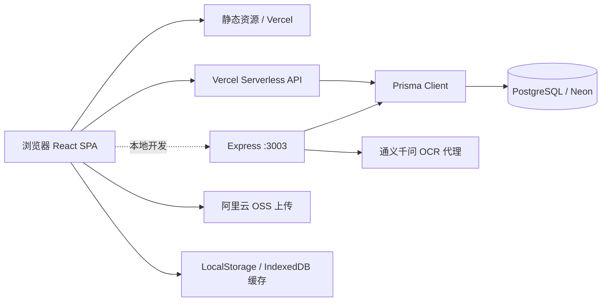

# 穆氏家谱 / Cyber Family Tree 产品与技术规格

版本：v0.2  
状态：基于现有代码的产品基线与后续规划  
更新时间：2026-07-13

## 1. 当前产品定义

本项目是一个面向家族成员的在线可视化家谱系统：用户可以浏览穆氏家谱，搜索和筛选成员，查看人物详情；注册用户可以创建/切换自己的家谱租户，并通过编辑页面维护家谱数据。系统还提供家谱图片 OCR、图片上传和 Vercel 部署能力。

建议的长期定位：**以家谱关系为入口、以家庭记忆和资料传承为差异化的隐私优先协作档案。**

当前产品仍然更接近“家谱可视化 + 数据编辑工具”，尚未完整实现“多人共同维护的家庭数字档案”。

## 2. 当前实现范围

### 已实现或已有代码支撑

- React 18 单页应用，Ant Design 5 界面。
- React Flow 11 + Dagre 家谱图、节点详情、缩放/平移、布局方向。
- 姓名、职位、地点搜索，代数筛选和智能折叠。
- 游客模式浏览默认“穆家家谱”。
- 邮箱验证码注册、登录、JWT 会话和个人信息读取。
- 多租户/家族空间雏形：租户选择、切换、创建和删除流程。
- Prisma + PostgreSQL 数据持久化；Vercel Serverless API。
- 本地 Express 服务，承载本地开发 API、OCR 代理和兼容逻辑。
- 阿里云 OSS 图片上传；通义千问 OCR 识别家谱图片并生成结构化数据。
- 浏览器缓存、LocalStorage 和 IndexedDB 搜索历史。

### 当前不应对外承诺为完整能力

- 租户没有 `User-Tenant Membership` 关系，API 只验证 JWT，不足以证明用户拥有请求的租户。
- 默认租户是硬编码演示数据，和用户自己的持久化家谱不是同一数据闭环。
- 家谱保存使用“删除租户全部数据后批量重建”，不是增量编辑，也没有冲突合并。
- `FamilyData` 以父母 ID、配偶字符串和子女字段承载关系，没有独立关系、来源、事件和证据实体。
- `DataVersion` 只具备快照模型，尚未形成面向用户的版本恢复、审计或审核工作流。
- 没有完整的邀请、成员角色、评论、待确认和协作通知体系。
- 公开分享、媒体元数据管理、结构化导入导出和家族年鉴成果物仍不完整。

## 3. 用户与核心场景

### 目标用户

- 家谱发起人：快速建立自己的家谱并邀请家人参与。
- 家谱整理者：维护人物信息、关系、照片和 OCR 结果。
- 普通家庭成员：搜索、浏览、补充和确认信息。
- 家族研究者：查看来源、版本和迁徙/事件脉络。

### MVP 验收场景

1. 用户注册后创建一个家族空间。
2. 用户添加至少三代人物和父母/配偶关系。
3. 用户可在图形、列表和人物详情之间切换浏览。
4. 用户邀请成员加入，并按角色限制查看/编辑范围。
5. 用户上传照片或家谱图片，OCR 结果必须经过人工确认才能入库。
6. 用户可以查看修改记录、撤销分享并导出完整数据。

## 4. 功能规格

### 4.1 家族空间与权限

建议角色：Owner、Editor、Contributor、Viewer。

- Owner：管理空间、成员、权限、导出和删除。
- Editor：维护人物、关系和记忆，处理确认任务。
- Contributor：新增或补充资料，不能删除关键数据。
- Viewer：只读访问授权内容。

权限必须绑定到 `tenantId + userId`，不能仅凭“登录过”访问任意租户。

### 4.2 人物与关系

保留现有 `FamilyData` 的兼容字段，同时逐步引入规范化实体：

- Person：姓名、别名、性别、出生/逝世、地点、简介、头像。
- Relationship：父母、子女、配偶/伴侣、收养、监护等关系类型。
- Fact：可带来源、置信度、确认状态和有效时间的事实。
- Event：出生、婚姻、迁徙、教育、职业和逝世等事件。

关系必须是一等实体，不能继续依赖 `spouse` 字符串或只保存父亲 ID。

### 4.3 记忆、媒体与 OCR

- Memory：照片、音频、视频、文档、文字故事和口述史。
- 每条 Memory 可关联人物、关系、事件、地点和时间段。
- OCR 输出保存原图、原始识别文本、结构化建议、操作者和确认状态。
- AI 结果只能作为草稿，不得自动覆盖已确认事实。

### 4.4 搜索与展示

- 家谱图：适合关系总览和聚焦某一支系。
- 列表：适合大量成员、批量编辑和移动端。
- 时间线：适合故事和事件。
- 搜索：按姓名、别名、地点、职业和关联关系检索。
- 图形视图必须提供文本/列表替代，保证可访问性。

## 5. 数据模型建议

现有核心模型：`User`、`Tenant`、`FamilyData`、`FamilyConfig`、`DataVersion`、`VerificationCode`。

下一阶段建议补充：

`TenantMembership`、`Person`、`Relationship`、`Fact`、`Event`、`Memory`、`MediaAsset`、`Source`、`ReviewTask`、`Comment`、`AuditLog`。

迁移原则：先为现有 `FamilyData` 建兼容层，再逐步把关系、事实和媒体从 JSON/字符串字段迁出；不要一次性破坏现有默认家谱和接口。

## 6. 系统架构

### 运行时说明

- 生产路径：React 构建产物由 Vercel 提供，`api/**/*.js` 作为 Serverless Functions，Prisma 访问 Neon PostgreSQL。
- 本地路径：`npm run dev` 同时启动 Create React App 和 Express；前端通过 proxy 访问 `localhost:3003`。
- 数据流：前端先读取默认数据或缓存，再异步请求租户数据；保存时向 API 提交租户下的整批数组。
- 媒体流：当前前端可直接初始化 OSS 客户端；生产应改为后端签名 URL/STS 临时凭证。
- OCR 流：图片上传后由本地 Express 代理调用通义千问，再返回结构化候选数据。

## 7. 安全、隐私与可靠性要求

- 生产环境禁止使用代码内 fallback JWT secret，缺失时应启动失败。
- 不得把 `REACT_APP_OSS_ACCESS_KEY_SECRET` 等长期 OSS 密钥打进浏览器构建产物。
- 所有租户读写接口都要校验 membership/owner，不得只校验 JWT 有效性。
- 在世人物、未成年人、住址、联系方式和证件信息默认私密。
- 保存操作采用事务、校验和版本号，避免“先删后插”造成数据丢失。
- OCR、导出、分享和删除都要记录审计日志。
- 提供 JSON/CSV + 媒体索引导出，避免用户被平台锁定。

## 8. 分阶段路线

### P0：收敛现有系统

统一生产/本地 API 约定，补齐租户归属校验、修复密钥与 OSS 安全问题，补充回归测试。

### P1：可用的个人家谱

实现真正的租户持久化、人物增删改、关系编辑、导入导出和版本恢复。

### P2：家庭协作档案

成员邀请、角色权限、待确认、评论、来源、时间线、照片/口述史管理。

### P3：智能整理与成果物

OCR 人工审核、重复人物提示、故事整理、家族年鉴/PDF/分享页生成。

