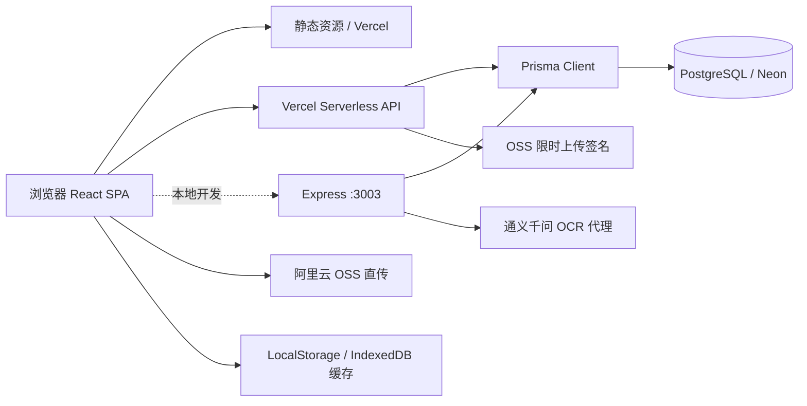

# 谱里数字家谱产品、技术与 Agent 维护规格

版本：v1.0
状态：MVP 后的公益多账户共创基线
更新时间：2026-07-14

## 1. 当前产品定义

本项目是一个面向普通家庭的公益性、隐私优先、多账户数字家谱软件。它服务两类人：想从零建家谱的家庭，以及家里只有长辈手中的纸质册子、照片或零散记忆，想逐步复刻和续录的家庭。

核心主张：**看家谱，续家谱，管家谱。**

产品愿景：把人肉照图抄录、Excel、数据库和云端工具逐步连接起来，让今天愿意记录家事的人，能把家族的世系、人物、地域迁徙、照片、故事和来源留给子孙。产品可以使用互联网与 AI 降低整理门槛，但不能让技术取代家人的确认和记忆。

默认隐私：家谱私密、仅受邀成员访问、在世人物敏感信息受保护、公开分享由 Owner 主动开启。

当前主导航固定为：`看家谱`、`续家谱`、`家族设置`。穆氏仅是只读示范家谱，不代表平台姓氏，也不应与用户家谱混淆。

当前产品仍然更接近“家谱可视化 + 数据编辑工具”，尚未完整实现“多人共同维护的家庭数字档案”。

## 2. 当前实现范围

### 已实现或已有代码支撑

- React 18 单页应用，Ant Design 5 界面。
- React Flow 11 + Dagre 家谱图、节点详情、缩放/平移、布局方向。
- 姓名、职位、地点搜索，代数筛选和智能折叠。
- 游客模式只读浏览“穆氏示范家谱”。
- 邮箱验证码注册、登录、JWT 会话和个人信息读取。
- `TenantMembership` 绑定用户与家谱，核心接口执行角色校验。
- 家谱保存使用事务、版本快照和乐观冲突检查。
- OSS 上传使用服务端限时签名，浏览器不持有长期密钥。
- Prisma + PostgreSQL 数据持久化；Vercel Serverless API。
- 本地 Express 服务，承载本地开发 API、OCR 代理和兼容逻辑。
- 阿里云 OSS 图片上传；通义千问 OCR 识别家谱图片并生成结构化数据。
- 浏览器缓存、LocalStorage 和 IndexedDB 搜索历史。

### 当前不应对外承诺为完整能力

- 邀请、成员管理与 Contributor 待确认工作流尚未实现。
- 默认示范租户与用户私有家谱是两条明确的数据链；示范租户始终只读。
- 家谱保存仍是整谱替换，虽已有事务与冲突保护，但尚未升级为人物级增量编辑。
- `FamilyData` 以父母 ID、配偶字符串和子女字段承载关系，没有独立关系、来源、事件和证据实体。
- `DataVersion` 只具备快照模型，尚未形成面向用户的版本恢复、审计或审核工作流。
- 没有完整的邀请、成员角色、评论、待确认和协作通知体系。
- 公开分享、媒体元数据管理、结构化导入导出和家族年鉴成果物仍不完整。

## 3. 用户与核心场景

### 目标用户

- 家谱发起人：快速建立自己的家谱并邀请家人参与。
- 家谱整理者：维护人物信息、关系、照片和 OCR 结果。
- 普通家庭成员：搜索、浏览、补充和确认信息。
- 家族研究者：查看来源、版本和迁徙/事件脉络。

### MVP 后续验收场景

1. 用户注册后创建一个独立家族空间。
2. 用户添加至少三代人物和父母/配偶关系。
3. 用户可在图形、列表和人物详情之间切换浏览。
4. 用户邀请成员加入，并按角色限制查看/编辑范围；在邀请能力尚未完成前，不对外宣称已支持完整协作。
5. 用户上传照片或家谱图片，OCR 结果必须经过人工确认才能入库。
6. 用户可以查看修改记录、撤销分享并导出完整数据。

## 4. 功能规格

### 4.1 家族空间与权限

建议角色：Owner、Editor、Contributor、Viewer。

- Owner：管理空间、成员、权限、导出和删除。
- Editor：维护人物、关系和记忆，处理确认任务。
- Contributor：新增或补充资料，不能删除关键数据。
- Viewer：只读访问授权内容。

权限必须绑定到 `tenantId + userId`，不能仅凭“登录过”访问任意租户。

### 4.2 人物与关系

保留现有 `FamilyData` 的兼容字段，同时逐步引入规范化实体：

- Person：姓名、别名、性别、出生/逝世、地点、简介、头像。
- Relationship：父母、子女、配偶/伴侣、收养、监护等关系类型。
- Fact：可带来源、置信度、确认状态和有效时间的事实。
- Event：出生、婚姻、迁徙、教育、职业和逝世等事件。

首版展示聚焦传统父系谱；底层迁移时仍应让关系成为一等实体，为母系记录和历史资料完整性留出空间，但不在首版突出复杂现代家庭模式。

### 4.3 记忆、媒体与 OCR

- Memory：照片、音频、视频、文档、文字故事和口述史。
- 每条 Memory 可关联人物、关系、事件、地点和时间段。
- OCR 输出保存原图、原始识别文本、结构化建议、操作者和确认状态。
- AI 结果只能作为草稿，不得自动覆盖已确认事实。

### 4.4 搜索与展示

- 家谱图：适合关系总览和聚焦某一支系。
- 列表：适合大量成员、批量编辑和移动端。
- 时间线：适合故事和事件。
- 搜索：按姓名、别名、地点、职业和关联关系检索。
- 图形视图必须提供文本/列表替代，保证可访问性。

## 5. 数据模型建议

现有核心模型：`User`、`Tenant`、`TenantMembership`、`FamilyData`、`FamilyConfig`、`DataVersion`、`VerificationCode`。

下一阶段建议补充：

`Invitation`、`Person`、`Relationship`、`Fact`、`Event`、`Memory`、`MediaAsset`、`Source`、`ReviewTask`、`Comment`、`AuditLog`。

迁移原则：先为现有 `FamilyData` 建兼容层，再逐步把关系、事实和媒体从 JSON/字符串字段迁出；不要一次性破坏现有默认家谱和接口。

## 6. 系统架构

### 运行时说明

- 生产路径：React 构建产物由 Vercel 提供，`api/**/*.js` 作为 Serverless Functions，Prisma 访问 Neon PostgreSQL。
- 本地路径：`npm run dev` 同时启动 Create React App 和 Express；前端通过 proxy 访问 `localhost:3003`。
- 数据流：前端先读取默认数据或缓存，再异步请求租户数据；保存时向 API 提交租户下的整批数组。
- 媒体流：前端向服务端申请五分钟有效的 PUT URL 后直传 OSS；长期密钥只在服务端。
- OCR 流：图片上传后由本地 Express 代理调用通义千问，再返回结构化候选数据。

## 7. 安全、隐私与可靠性要求

- 生产环境禁止使用代码内 fallback JWT secret，缺失时应启动失败。
- 不得把 `REACT_APP_OSS_ACCESS_KEY_SECRET` 等长期 OSS 密钥打进浏览器构建产物。
- 所有租户读写接口都要校验 membership/owner，不得只校验 JWT 有效性。
- 在世人物、未成年人、住址、联系方式和证件信息默认私密。
- 保存操作采用事务、校验和版本号，避免“先删后插”造成数据丢失。
- OCR、导出、分享和删除都要记录审计日志。
- 提供 JSON/CSV + 媒体索引导出，避免用户被平台锁定。

## 8. 分阶段路线

### P0：收敛现有系统（本轮已完成主体）

已完成：通用品牌与主框架、租户归属校验、生产 JWT 强制配置、服务端 OSS 签名、整谱事务与版本冲突保护。待完成：本地 Express 与 Vercel API 运行入口统一、字段级隐私输出和接口回归测试。

### P1：可用的个人家谱

实现真正的租户持久化、人物增删改、关系编辑、导入导出和版本恢复。

### P2：家庭协作档案

成员邀请、角色权限、待确认、评论、来源、时间线、照片/口述史管理。

### P3：智能整理与成果物

OCR 人工审核、重复人物提示、故事整理、家族年鉴/PDF/分享页生成。

## 9. 公益产品原则

1. **普通家庭优先**：不要求用户懂谱牒、数据库或复杂家族术语；从一个人、一张照片、一段口述也能开始。
2. **记录优先于完美**：允许未知、待考、多个说法和来源并存，不为了“好看”擅自补全或抹平争议。
3. **隐私优先于传播**：默认私密、按家谱空间隔离；在世人物、未成年人、住址、联系方式和证件信息默认不公开。
4. **人工确认事实**：OCR 或 AI 只能生成草稿，必须保留原始材料，并由人确认后才能成为正式事实。
5. **可带走、可延续**：提供可理解、可备份、可迁移的导出；避免用户因平台变化失去家族资料。
6. **面向子孙的可读性**：产品输出不仅服务录入者，也要让多年后的家人能看懂人物、关系、时间、地点和来源。
7. **公益与可持续并存**：基础建谱和浏览能力应长期可用；商业化、云资源和运营成本不能以牺牲隐私或数据可携带性为代价。

## 10. Agent 工作协议

### 文档优先级

Agent 每次开始任务时按以下顺序理解项目：

1. `README.md`：项目是什么、如何运行、如何参与。
2. `SPEC.md`：当前定位、不可违反的产品/技术/隐私边界，以及明确的未来方向。
3. `AGENTS.md`：代码修改、测试、安全和文档维护的执行约束。
4. 代码、数据库 schema、迁移和测试：以当前实现验证规格，不把旧文档当作事实来源。

`docs/` 已废弃。不要在其中新增设计说明、修复总结或路线图；若发现旧文档与代码冲突，以代码、测试和本文件为准，并在必要时更新本文件。

### 修改前检查

- 明确改动属于“看家谱、续家谱、管家谱”中的哪一类。
- 涉及用户、家谱、媒体或 AI 时，先检查租户隔离、角色授权、隐私裁剪和数据可恢复性。
- 涉及数据结构时保留 `FamilyData` 兼容读取，优先增量迁移，不静默覆盖已确认事实。
- 涉及 OCR/AI 时确认原图、原文、候选结果和人工确认状态仍可追溯。
- 不把演示家谱、测试数据或旧修复方案误当成用户数据和现行架构。

### 修改后交付

- 对行为变化添加或更新聚焦测试，至少覆盖授权、租户隔离、版本冲突和隐私过滤中的相关项。
- 运行与改动范围匹配的 lint、format、测试和 build；报告未运行的检查及原因。
- 若改变产品规则、数据模型、权限、隐私或部署路径，同步更新本文件。
- 保持 README 的命令、链接和产品描述可用；避免新增临时性长文档。
