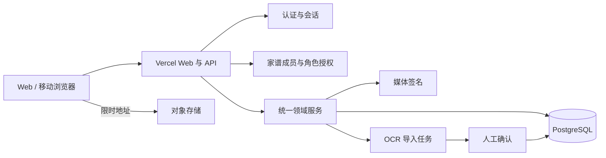

# 谱里：产品、视觉与 SaaS 架构升级评审

更新时间：2026-07-13

## 1. 产品结论

“谱里”暂作为工作品牌，主张为“互联网人的第一本数字家谱”。穆氏家谱保留为真实示范内容和冷启动样板，不再承担平台品牌。

首批用户聚焦两类互相重叠的人群：愿意为家庭做一次数字化整理的互联网从业者，以及对国学、谱牒和家族文化有兴趣的人。冷启动不是建设公共姓氏数据库，而是由创始人的真实案例和熟人网络发起一个个私密家谱。

首版只解决五件事：创建家谱、录入人物、建立传统世系、邀请家人查看或补充、完整导出。时间线、口述史、年鉴和 AI 整理是后续留存能力，不进入首版主导航。

## 2. 品牌候选

| 名称 | 定位感觉 | 结论 |
| --- | --- | --- |
| 谱里 | 现代、温和，有“家人在谱里”的空间感 | 本轮推荐工作品牌 |
| 家乘 | 传统谱牒术语，文化感强 | 适合内容栏目，公众理解成本略高 |
| 续谱 | 行动直接，利于解释产品 | 过于通用，品牌独占性弱 |
| 吾谱 | 个人感强、容易理解 | 需进一步核验同名与商标 |

“族迹”已有同类产品使用，不建议采用。正式发布前必须单独核验商标、域名、微信公众号/小程序和应用商店名称；普通网页搜索不能替代法律层面的商标检索。

## 3. 信息架构

- 看家谱：默认进入可缩放世系图；桌面端强调全局关系，移动端后续增加“搜索 + 人物列表 + 聚焦支系”。
- 续家谱：新增、编辑、批量导入和 OCR 候选确认。用户语言统一用“续录”，不暴露“数据管理、租户”等后台术语。
- 家族设置：家谱名称、隐私、成员、导出与删除。邀请功能完成前不提前展示空入口。

## 4. 视觉语言

主题采用宣纸暖白、黛青、少量朱砂与铜金。字体以现代无衬线保证信息密度，仅在品牌、家谱名和人物名使用宋体气质。背景使用低对比网格和自然色晕染，避免龙纹、卷轴、毛笔字等强仿古元素。

设计原则：清淡而不苍白，国风而不戏服化，一屏内优先展示家谱本身；装饰永远不能压过搜索、人物和关系。

## 5. 当前架构评审

### 已在本轮落地

- 新增 `TenantMembership`，核心家谱、租户和上传接口按 `userId + tenantId + role` 授权。
- 注册自动创建私密家谱；旧账号首次登录自动补齐 Owner 归属。
- 示范家谱固定只读，登录用户直接进入自己的上次家谱，不再先加载示范数据。
- 生产环境没有 `JWT_SECRET` 时拒绝认证，不再使用公共 fallback secret。
- 删除浏览器 OSS SDK 和前端长期密钥，改为五分钟有效的服务端签名 PUT URL。
- 通义千问密钥改为 `DASHSCOPE_API_KEY` 服务端变量，OCR 本地代理要求登录。
- 整谱保存放入数据库事务，每次生成 `DataVersion`，客户端携带期望版本防止静默覆盖。
- 页面数据读取统一经过 `familyDataService`，移除页面层错误的动态 API 路径。

### 仍需升级

1. 本地 Express 与 Vercel Functions 仍是两个入口。目标是只保留一套路由处理器和业务服务；短期建议开发环境使用与生产一致的 Vercel Runtime，Express 仅保留必要的本地工具。
2. `FamilyData` 仍同时承担人物、关系和敏感资料。P1 应先拆 `Person` 与 `Relationship`，保持旧字段兼容读，写入逐步转到新表。
3. 当前版本保护只能阻止整谱并发覆盖，不能支持多人同时编辑不同人物。人物级 API 应使用 `updatedAt/version` 乐观锁和审计日志。
4. 字段级隐私尚未进入查询层。API 输出需依据查看者角色、人物是否在世、是否未成年和家谱分享模式裁剪字段。
5. OCR 仍是内存候选。需要 `ImportJob/ReviewTask` 保存原图、原文、候选字段、操作者与确认状态。
6. 大陆访问体验不能只以 Vercel 海外链路为前提。冷启动可继续 Vercel，但需要真实用户监测；增长前评估国内云、备案域名、对象存储与邮件/短信登录替代方案。

## 6. 目标架构

前端永远不决定权限；每次读写都由服务端从登录用户与家谱归属计算授权。所有 AI 结果先进入候选层，确认后才成为正式家谱事实。

## 7. 分阶段实施

### P0：可安全试用

部署本轮 membership 迁移；完成字段级隐私、API 回归测试和本地/生产入口统一。发布对象限定为受邀小圈子。

### P1：一个家庭够用

人物级增删改、传统父系关系编辑、邀请与角色、JSON/CSV 导出、版本恢复、移动端人物列表。此阶段完成后才适合将“每个人都能创建自己的家谱”作为稳定承诺。

### P2：家庭共同续谱

Contributor 待确认、修改记录、资料来源、照片与故事、OCR 审核、通知。重点指标从注册量转为“完成三代录入的家谱数”和“有第二位家人参与的家谱数”。

### P3：传承成果物

家族时间线、纪念页、年鉴/PDF、受控公开分享和迁徙地图。所有成果物必须可撤销分享并尊重人物级隐私。

## 8. 发布前验收线

- 用户 A 无法猜 ID 读取、写入或上传到用户 B 的家谱。
- 示范家谱无法被任何普通账号修改。
- 同一家谱两次并发保存时，后保存者收到冲突提示而不是覆盖。
- 前端构建产物不包含 JWT、OSS、OCR 或邮件长期密钥。
- 新家谱默认私密；公开分享必须由 Owner 明确开启。
- 用户可以导出全部结构化家谱数据与媒体索引。
